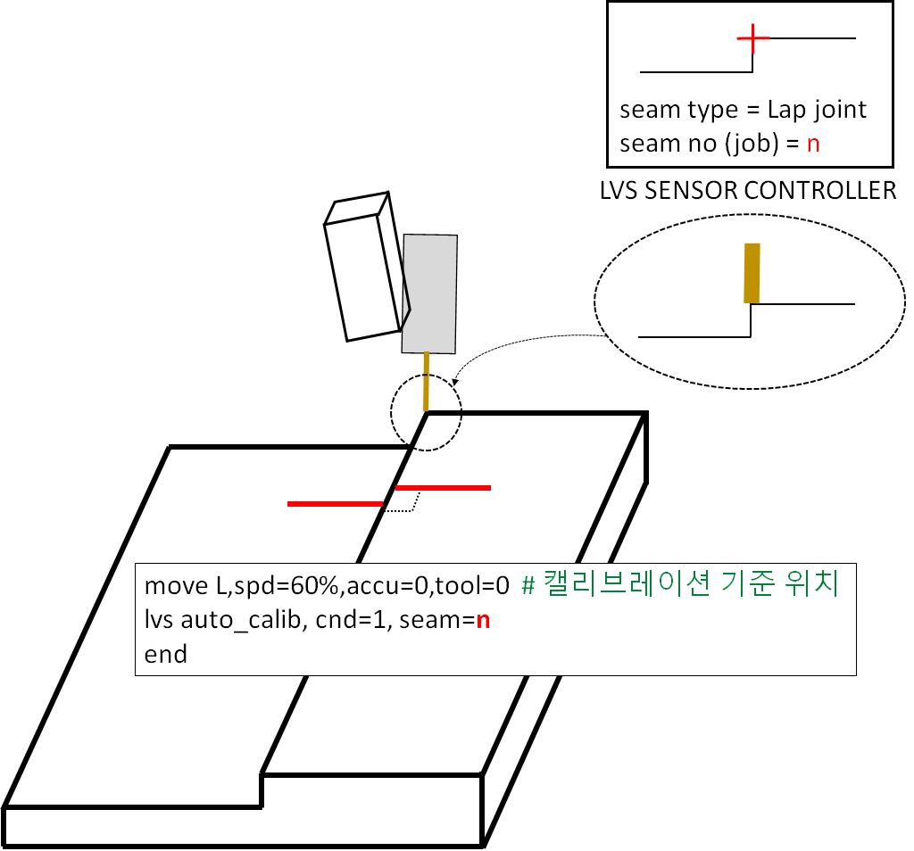

# 8.5.3 LVS(Laser Vision Sensor) TCP-센서 캘리브레이션

LVS기능을 사용하기 위해서 TCP와 센서좌표계 간 캘리브레이션이 선행되어야 합니다. 

Hi6 제어기는 자동캘리브레이션을 지원합니다.

지금부터 tcp-lvs센서 자동캘리브레이션 수행 방법을 살펴보겠습니다.

(1) 캘리브레이션 시편 준비

당사를 통해 라이센스 구입을 하면 자동캘리브레이션용 시편을 제공합니다. 


테스트 용도 사용하고자 한다면 당사에 요청하여 캘리브레이션 시편을 준비하십시오.


---

(2) 자동캘리브레이션 티칭

다음과 을 참고하여 티칭하십시오.

```python
move L,spd=60%,accu=0,tool=0  # 캘리브레이션 시편 기준점 위치
delay 0.5
lvs auto_calib, cnd=1, seam=1, sp=p1, opt=0
end
```

아래 그림과 같이 시편의 기준점에 TCP를 조그로 이동시키십시오. 

TCP 자세는 시편과 수직으로 위치해야 합니다. (Roll, Pitch 방향 모두 수직)

레이저 라인은 시편의 엣지 부분과 수직이 되도록 조그 (보통 Tool Z로 조작)로 위치 하십시오.

이 상태 (토치가 시편과 수직으로 위치하고 레이저 라인은 시편의 엣지에 수직인 상태)에서 [기록]을 눌러 move 명령어를 삽입합니다.

[명령입력]-[arcweld]-[lvs] 를 눌러 명령어를 삽입합니다.

lvs 명령어의 seam 인자는 LVS controller에 등록한 형상 및 조건에 대한 번호입니다.


캘리브레이션을 위해서 Lap 조인트로 LVS제어기에 미리 seam을 등록해 놓으십시오.


<p align="center">
 </img>
 <em><p align="center">그림. lvs 자동 캘리브레이션</p></em>
</p>   
</br>

---

(3) 준비사항

자동캘리브레이션은 앞뒤, 좌우 이동 및 roll 방향 회전, 높이방향 이동을 포함하는 모션을 수행하므로 안전에 유의하십시오.


* 높은 위치에서도 lvs가 시편의 seam을 인식할 수 있도록 lvs의 설정 (노출시간, 레이저세기, 형상 설정)을 조절하십시오.
* 레이저가 시편 기준점 바깥쪽 평평한 면을 보고있을 때에는 lvs제어기가 seam을 인식 할 수 없어야 합니다.


---

(4) 자동모드로 재생합니다.

이때 lvs 모니터링을 열어서 테이블의 info 항목에서 캘리브레이션이 모두 끝나면 comp! 표시가 나타납니다.

---

(5) 툴과 lvs 캘리브레이션 정보

툴 번호마다 lvs 캘리브레이션 정보를 갖고 있습니다. 이는 툴 체인지를 사용할 경우에 유용합니다.

만약 tool 0번에 자동캘리브레이션을 수행한 후 tool 1번이나 2번을 사용하고자 한다면 해당 툴에 대한 자동캘리브레이션을 수행해야 합니다.

툴 정보는 같지만 번호만 다르게 사용하고 싶다면 다음 창에 진입하여 캘리브레이션 정보를 복사하여 사용할 수 있습니다.

[시스템]-[응용파라미터]-[lvs 추종]-[캘리브레이션]

<p align="center">
 </img>
 <em><p align="center">그림. lvs 자동 캘리브레이션</p></em>
</p>   
</br>