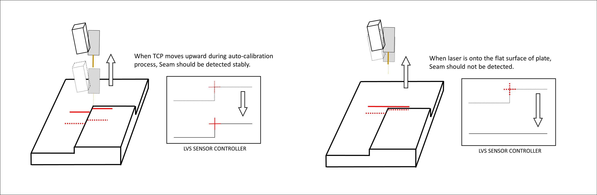

# 8.5.3 LVS Calibration

In order to use the LVS funtionality, calibration between the TCP and sensor coordinate system must be performed first.

${cont_model} controller supports automatic calibration.

Let's now look at how to perform automatic calibration between TCP and LVS sensor.

### (1) Preparation of Calibration Specimen

Prepare a 15 cm long lap joint specimen with a 3 mm step.


If you wish to use it for testing purpose, please contact us to prepare the calibration specimen.


---
### (2) Automatic Calibration Teaching
Please refer to the following when teaching.

```python
move L,spd=60%,accu=0,tool=0  # Calibration specimen reference point location
delay 0.5
lvs auto_calib, cnd=1, seam=1, sp=p1, opt=0
end
```


For Scansonic Full-V sensors, using opt=20 allows for precise calibration.


Move the TCP to the reference point of the specimen using the jog tool as shown in the figure below. It is recommended to use the Tool coordinate system jog tool during calibration.

As shown in Figures 1 and 2, half of the wire must be positioned so that it reaches the corner of the specimen from each direction.

The torch must be positioned perpendicular to the specimen. (Perpendicular in both roll and pitch directions)

Position the laser line with the jog so that it is perpendicular to the edge of the specimen.

In this state (where the torch is positioned perpendicular to the specimen and the laser line is perpendicular to the edge of the specimen), press **[Record]** to insert the `move` command.


* Use a spirit level to align the calibration specimen perpendicularly from all directions.
* The verticality of the torch and the degree to which the laser line is perpendicular to the edge of the specimen affect the calibration accuracy.


Insert `delay 0.5`, then insert the `lvs` command.

The `seam` argument of the `lvs` command is the number for the geometry and condition registered in the LVS controller.


For calibration, register the seam as a Lap joint in the LVS controller software.<br>
Set the registered number in the seam argument of the lvs command.


  
*Figure 8.5.7. LVS Auto Calibration*  

---

### (3) Preparations

Automatic Calibration involves motions such as front/back, left/right, roll direction rotation, and height adjustments, so ensure safety precautions are followed.


* Adjust the LVS settings (exposure time, laser intensity, shape settings) so that the LVS can recognize the seam of the specimen even at higher positions.
* When the laser is pointing to the flat surface outside the reference point of the specimen, the LVS controller should not be able to recognize the seam.


<br>

---

### (4) Execution

Once calibration is complete, the "comp!" indicator will appear in the 'info' section of the 'LVS tracking' monitoring table.

---

### (5) Tool and LVS Calibration Information

Each tool number has its own LVS calibration, which is useful when using tool changing.

If you perform automatic calibration for tool 0 and want to use tool 1 or tool 2, you will need to perform automatic calibration for those tools as well.

If you want to use the same tool information but with different numbers, you can enter the following window to copy and apply the calibration information.

- Navigate to `[F2: System] - 4: Application parameter - 5: LVS tracking - 2: LVS Calibration`.<br>

<br>
*Figure 8.5.8. LVS Calibration Information*   
</br>