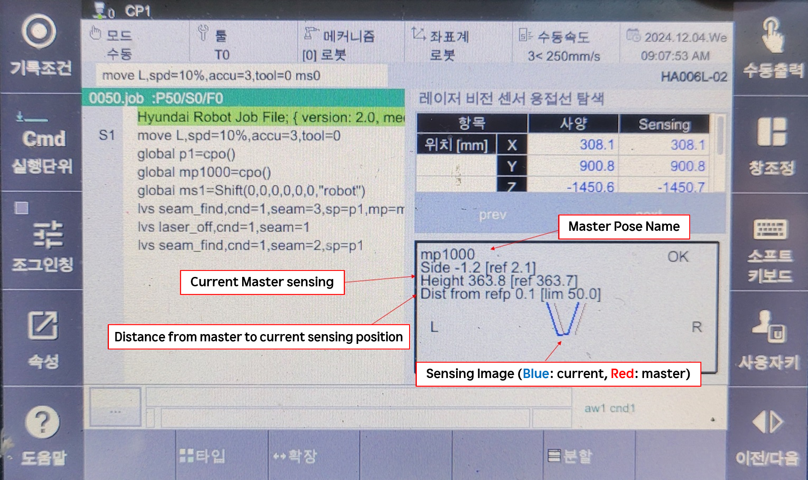

# 8.5.4 LVS 接缝查找功能

### (1) 接缝查找概述

此功能将 LVS 传感器感知的位置存储为姿势，可以用作触觉感应的替代。


如果在使用此功能之前未进行 TCP-LVS 传感器校准，将会保存异常姿势。


命令格式如下：  
执行后，如下所示，LVS 传感器感知的位置将存储在 po_100 变量中。

```python
  var po_100=cpo()  # 当前姿势存储在变量 po_100 中
  lvs seam_find, cnd=1, seam=1, sp=po_100 # 如果在 sp 参数中输入的名称没有变量，将自动声明为局部姿势变量。
```


如果 **sp** 参数未声明，将声明为局部姿势。 <br>
如果 **mp** 参数未声明，将声明为全局姿势。 <br>
如果 **ms** 参数未声明，将声明为全局偏移。



<br>
*图 8.5.9. 在 LVS 感应位置中的姿势*   
</br>


- 使用 **seam_find** 命令时，存储在 sp 参数中的姿势的方向将保持在感应前工具的方向 (Rx, Ry, Rz)。
- 另一方面，使用 **seam_find_p** 命令，仅记录位置在存储在 sp 参数中的姿势中。


* 如果你想无视预感应方向，仅在姿势中存储位置，请使用以下命令格式。<br>
当你想记录焊接姿势并使位置 (X, Y, Z) 对应于 LVS 感知的点时，此功能非常有用。

```python
var po_100=cpo()
lvs seam_find_p, cnd=1, seam=1, sp=po_100
```

* 从感知位置向 Tool Y 和 Tool Z 方向偏移的姿势可以根据如下方式计算。 <br>
此命令计算在感应时工具方向上偏移 10mm 的 Tool Y 和 10mm 的 Tool Z 的姿势。

```python
var po_100=cpo()
lvs seam_find, cnd=1, seam=1, side=10, height=10, sp=po_100
```

---

### (2) LVS 接缝查找重试

如果在接缝查找过程中无法识别接缝，将进行重试。

重试次数在 LVS 命令属性窗口的接缝查找选项中的 **"重试次数"** 指定。

如果在指定的重试次数后仍然无法感应，将会出现错误。

重试过程以以下顺序进行：

<br>
*图 8.5.10. LVS 接缝查找重试*   
</br>


* 使用主偏移功能时，请注意重试会导致位置前后移动（由 +ToolX, -ToolX）。


---

### (3) LVS 接缝查找监控

要查看 LVS 接缝查找监控屏幕，请在 TP 中点击 `[pane layout] - 选择 - LVS 焊缝寻址 ([pane layout] - select - LVS seamfind)`  


<br>
*图 8.5.11. LVS 接缝查找监控*   
</br>
<table>
  <thead>
    <tr>
      <th style="text-align:left">项目</th>
      <th style="text-align:left">描述</th>
    </tr>
  </thead>
  <tbody>
    <tr>
      <td style="text-align:left">位置 (X, Y, Z)</td>
      <td style="text-align:left">
        显示当前感知的位置（以基坐标表示）<br>
        规格：主姿势的位置。如果未注册，将显示为 (-1, -1, -1)<br>
        感应：当前感知到的位置 
      </td>
    </tr>
    <tr>
      <td style="text-align:left">间隙</td>
      <td style="text-align:left">
        规格：主间隙 [mm]<br>
        感应：当前感知到的间隙 [mm]
      </td>
    </tr>
    <tr>
      <td style="text-align:left">面积</td>
      <td style="text-align:left">
        槽或对接形状的内部面积宽度 [mm^2]<br>
        规格：主面积 [mm]<br>
        感应：当前感知到的面积 [mm]
      </td>
    </tr>
    <tr>
      <td style="text-align:left">不匹配</td>
      <td style="text-align:left">
        不匹配值通常指的是左右形状的高度差。
      </td>
    </tr>
  </tbody>
</table>

  仅在制造商的LVS控制器支持的接缝处显示间隙、区域、不匹配和类似值。


如果主姿态已注册，您可以通过按上一页或下一页按钮查看当前工作的传感历史记录。


  有关主模式的更多详细信息，请参阅 [8.5.5 LVS主模式功能](./5_lvs_master_mode.md)。
