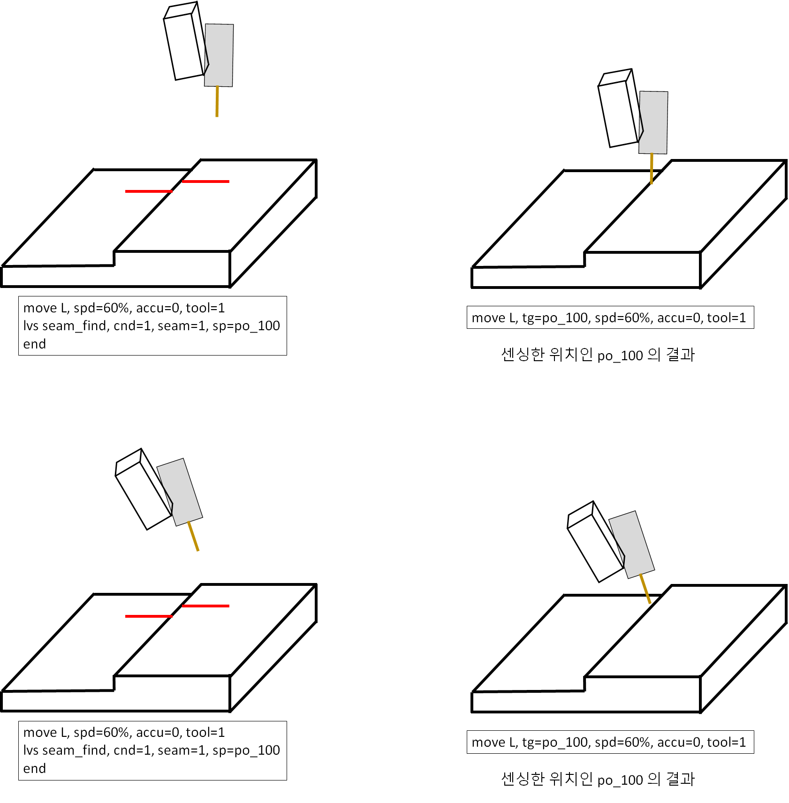
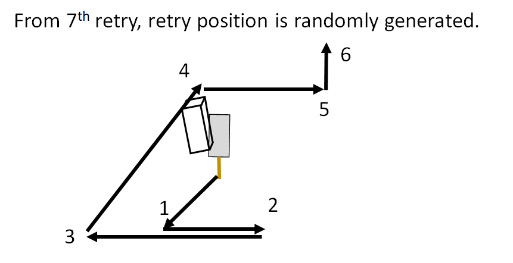

# 8.5.4 LVS(Laser Vision Sensor) seam finding 기능

1. Seam finding 기능의 개요

이 기능은 LVS를 이용하여 센싱한 위치를 포즈로 저장하는 기능으로 터치센싱 대용으로 사용 가능합니다. 


기능 사용전 TCP-센서 캘리브레이션이 수행되어 있지 않으면 비정상적인 포즈가 저장됩니다.


명령어 형식은 다음과 같습니다.

```python
var po_100=cpo() #현재 포즈를 선언한 변수 po_100에 저장함
lvs seam_find, cnd=1, seam=1, sp=po_100
```

위 명령어를 수행하면 po_100 변수에 lvs로 센싱한 위치(x,y,z)가 저장됩니다.


seam_find 명령어로 sp 인자에 저장된 포즈의 자세는 센싱 전 자세 (RX, RY, RZ) 입니다.


즉, 아래 그림과 같이 센싱 전 툴의 자세에 따라 sp 인자에 저장된 포즈의 자세가 결정됩니다.

<p align="center">
 </img>
 <em><p align="center">그림. lvs 센싱 자세에 따른 포즈에서의 자세</p></em>
</p>   
</br>

만약 센싱 전 자세와 상관없이 포즈에 위치만 저장하고 싶다면 다음과 같은 명령어 형식을 이용합니다.<br>
이 기능은 포즈에 용접자세를 기록해 놓은 뒤 위치(X,Y,Z) 만 lvs로 센싱한 점으로 계산하고자 할때 유용하게 사용 할 수 있습니다.


```python
var po_100=cpo() #현재 포즈를 선언한 변수 po_100에 저장함
lvs seam_find_p, cnd=1, seam=1, side=10, height=10, sp=po_100
```


센싱한 위치에서 센싱시 툴의 자세 방향으로 쉬프트한 포즈는 다음과 같이 티칭할 수 있습니다.<br>
이 기능은 센싱 위치에서 쉬프트를 적용해 포즈를 계산하고자 할 때 유용하게 사용할 수 있습니다.

```python
var po_100=cpo() #현재 포즈를 선언한 변수 po_100에 저장함
lvs seam_find, cnd=1, seam=1, side=10, height=10, sp=po_100
```

위 명령어는 센싱한 위치에서 센싱시 툴의 자세로 tool_y 방향으로 10mm, tool_z 방향으로 10mm 이동된 포즈를 계산합니다.

2. lvs seamfinding 재시도 기능

seam finding을 수행하였는데 센서에서 seam 인식이 불가능하다면 재시도를 수행합니다. <br>
재시도 횟수는 seam finding parameter의 no of retry 항목에 기입합니다.<br>
재시도 횟수만큼 센싱을 시도하여도 센싱이 불가능할 경우 에러가 발생합니다.<br>
재시도는 다음과 같은 위치로 이동하면서 수행합니다.<br>

<p align="center">
 </img>
 <em><p align="center">그림. seam finding 재시도 기능</p></em>
</p>   
</br>

3. lvs seamfinding 모니터링 기능

TP 우측의 [창조절] 버튼을 눌러 LVS 용접점 추출 항목을 선택하면 lvs seamfinding 모니터링을 볼 수 있습니다.

<p align="center">
 </img>
 <em><p align="center">그림. seam finding 모니터링 기능</p></em>
</p>   
</br>
<table>
  <thead>
    <tr>
      <th style="text-align:left">항목</th>
      <th style="text-align:left">설명</th>
    </tr>
  </thead>
  <tbody>
    <tr>
      <td style="text-align:left">위치 (X, Y, Z)</td>
      <td style="text-align:left">
        센싱한 위치를 표시합니다. (베이스 좌표계)
        사양 : 마스터 포즈의 위치입니다. 등록이 안된경우 (-1, -1, -1)로 표시됩니다.<br>
        센싱 : 현재 센싱한 위치입니다.
      </td>
    </tr>
    <tr>
      <td style="text-align:left">갭</td>
      <td style="text-align:left">
      사양 : 마스터 갭 [mm]<br>
      센싱 : 현재 센싱한 갭 [mm]
      </td>
    </tr>
    <tr>
      <td style="text-align:left">영역</td>
      <td style="text-align:left">
      groove 나 butt 형상의 내부 영역 넓이 [mm^2]
      사양 : 마스터 넓이 [mm]<br>
      센싱 : 현재 센싱한 넓이 [mm]
      </td>
    </tr>
    <tr>
      <td style="text-align:left">미일치</td>
      <td style="text-align:left">
       lvs seam의 미스매치 값을 보여줍니다. 보통 좌우 형상의 높이차를 말합니다. 
      </td>
    </tr>
  </tbody>
</table>


갭, 영역, 미스매치 등의 값은 제조사의 lvs 컨트롤러가 지원하는 seam에 대해서만 표시됩니다.


마스터 포즈가 등록되어 있다면, 현재 JOB에서 센싱한 이력들을 prev, next를 눌러서 확인해 볼 수 있습니다.


마스터모드 기능은 8.5.5 LVS master mode 기능을 참고하십시오.


