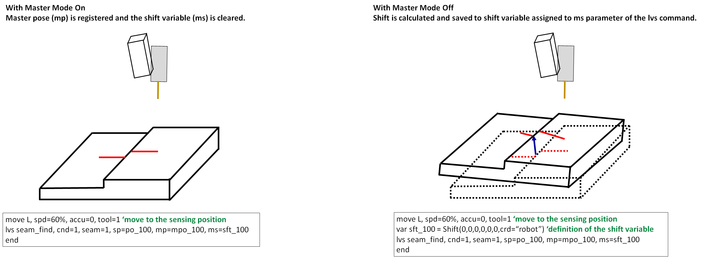
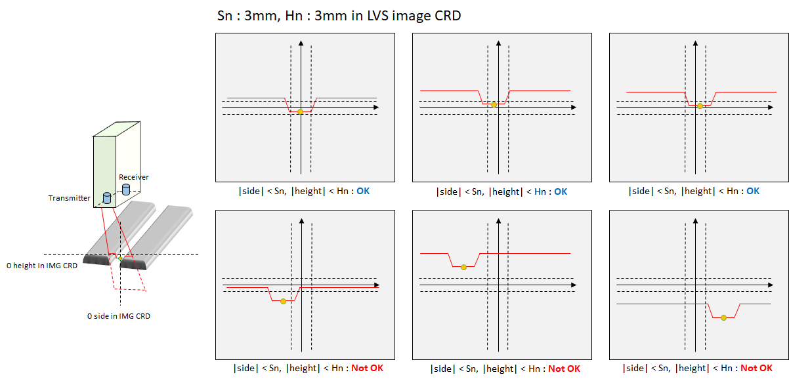

# 8.5.5 LVS(Laser Vision Sensor) master mode 기능

(1) master mode 개요

master mode 기능은 기준위치(마스터 포즈)를 저장해 놓고 실제 양산 시 기준 위치 대비 현재 센싱한 위치의 쉬프트를 구하는 기능입니다.

이를 위해서는 [사용자키] - [master mode] 를 활성화 하여 기준위치(마스터포즈)를 미리 등록해 두어야 합니다.

 </img>
 <em>
그림 8.5.12. 마스터모드와 실제 기동시의 동작의 예
</em>

   
 

위 그림의 왼쪽과 같이 master mode를 활성화 한 상태에서 마스터포즈를 lvs명령어의 mp인자에 할당된 포즈변수에 저장합니다.

일반적으로 각 센싱점들을 미리 티칭해 두고 master mode를 on 한 상태에서 자동으로 재생시켜 마스터 티칭을 완료합니다.

후판용접에서는 대략 수십개의 용접 경유점들이 마스터포즈로 등록될 것입니다.

마스터 티칭이 완료되면 master mode를 off합니다. 마스터모드는 마스터티칭이 완료되면 그 후 다시 on할 필요가 없습니다.

양산 시에는 로봇이 자동 또는 원격모드로 기동하여 각 용접점마다 센싱하여 쉬프트를 계산합니다.

이 때, lvs명령어의 ms 인자에 지정된 shift 변수에 마스터포즈 대비 현재 센싱한 포즈의 shift가 자동으로 계산되어 저장됩니다.

이 쉬프트 변수를 move문의 tg 인자에 적용하여 용접 위치에 쉬프트를 보정하여 용접 작업을 수행할 수 있습니다.


마스터포즈 등록시에는 하기 내용을 주의하십시오.

* 센싱하는 위치에서 LVS S/W에서 센싱된 seam의 side 및 height는 모두 0 근처에 오도록 티칭하시오. 
* 위와 같이 티칭하여 센싱을 안정적으로 수행할 수 있으며, 마스터 포즈 관리 및 LVS 또는 툴의 틀어짐에 인식을 손쉽게 할 수 있습니다.


 </img>
 <em>
그림 8.5.13. 마스터 포즈 등록시 유의점
</em>

   
 

---

(2) 마스터모드 대비 쉬프트량 검사 기능

마스터포즈 대비 현재 센싱한 포즈의 쉬프트량 (mm)이 사용자가 설정한 범위 내에 존재하는지 검사할 수 있습니다.

범위 설정은 lvs 명령어에서 [속성]창에 진입하여 seam finding parameter 항목의 distance from reference position 항목에 [mm] 단위로 기입합니다.

seam finding 수행시 shift량이 사용자가 설정한 범위를 벗어난다면 에러가 발생합니다.


sp인자가 선언되어 있지 않다면 지역 포즈로 선언됩니다. 
mp인자가 선언되어 있지 않다면 전역 포즈로 선언됩니다. 
ms인자가 선언되어 있지 않다면 전역 쉬프트로 생성됩니다.
