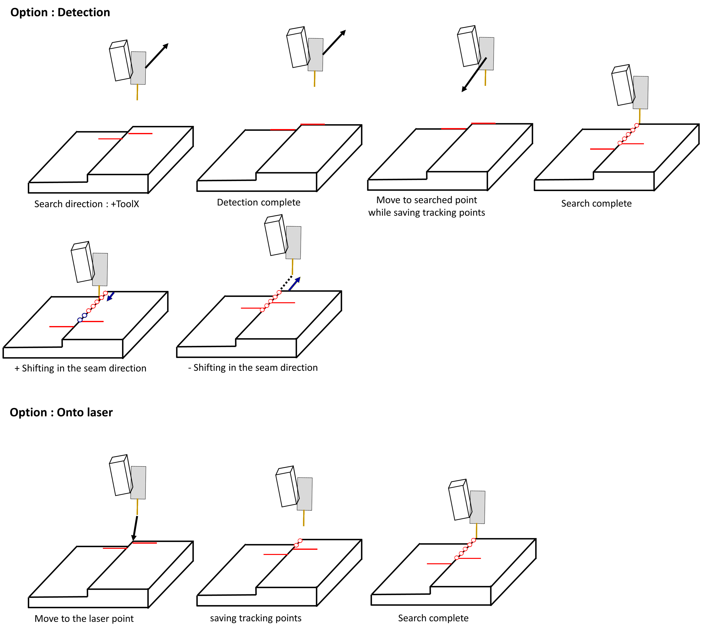

# 8.5.6 LVS(Laser Vision Sensor) search 기능

### (1) Search 기능 사용법

LVS는 search 기능을 제공하며 다음과 같은 목적으로 사용합니다.

- `search` : 시작점을 탐색하고 시작점으로 TCP가 이동하면서 추종할 위치를 설정 간격마다 버퍼에 저장하고 트래킹을 준비합니다.
- `step_search` : 다단비드 검출, 단차 검출 

search를 수행하면 탐색을 수행하며 무효점이 검출되면 가장 최근의 유효점을 `sp` 인자에 포즈로 저장합니다.

그 후 tracking을 준비하기 위해 찾은 점으로 TCP가 이동하면서 추종할 점들을 버퍼에 저장합니다.

search 기능을 수행하면 seam tracking을 수행할 수 있는 상태가 됩니다.


탐색 방법 : 유효하지 않은 seam (LVS 제어기가 seam을 검출하지 못하는 상태)을 검지하여 시작점을 탐색합니다.


search는 다음과 같이 사용합니다.

```python
  move L, spd=60%, accu=0, tool=1
  delay 0.1 #탐색 시작위치의 accu가 0이 아닐경우 삽입해야 함
  var po_100=cpo() #현재 포즈를 선언한 변수 po_100에 저장함
  lvs search, cnd=1, seam=1, sp=po_100
```

`lvs` 명령어에서 **[속성]** 에 진입하면 다음과 같이 search 설정을 수행할 수 있습니다.


<br>
*그림 8.5.14. lvs search 설정화면*   
</br>

<table>
  <thead>
    <tr>
      <th style="text-align:left">항목</th>
      <th style="text-align:left">설명</th>
    </tr>
  </thead>
  <tbody>
    <tr>
      <td style="text-align:left">function</td>
      <td style="text-align:left">
        search 기능의 사용을 설정합니다.<br>
        '무효' : lvs의 레이저 위치로 이동하면서 버퍼에 목표위치들을 저장합니다.<br>
        '유효' : 경우 탐색방향으로 시작점과 종료점을 검출한 후 검출한 위치로 이동하면서 버퍼에 목표위치들을 저장합니다.
      </td>
    </tr>
    <tr>
      <td style="text-align:left">direction</td>
      <td style="text-align:left">
       0 : +ToolX 방향으로 탐색합니다.<br>
       1 : -ToolX 방향으로 탐색합니다.
      </td>
    </tr>
    <tr>
      <td style="text-align:left">speed</td>
      <td style="text-align:left">
        탐색 속도를 mm/sec 단위로 설정합니다.
      </td>
    </tr>
    <tr>
      <td style="text-align:left">offset</td>
      <td style="text-align:left">
       탐색점에서 용접선 방향으로 찾은 점을 설정한 mm 만큼 쉬프트시킬 수 있습니다.
      </td>
    </tr>
  </tbody>
</table>

<br>
*그림 8.5.15. lvs search 예시*   
</br>

다음과 같이 search 및 seam tracking을 티칭할 수 있습니다.

```python
  move L, spd=60%, accu=0, tool=1
  delay 0.3
  var po_100=cpo() #현재 포즈를 선언한 변수 po_100에 저장함
  lvs search, cnd=1, seam=1, sp=po_100
  weavon cnd=1
  arcon cnd=1
  lvs track, cnd=1, seam=1, sp=po_100
  move L, spd=30cm/min, accu=3, tool=1
  move L, spd=36cm/min, accu=3, tool=1
  move L, spd=40cm/min, accu=3, tool=1
  weavoff
  arcof
  end
```

---

### (2) 다단비드 검출 기능 (step_search) 사용법

다단비드의 시작점을 검출해주는 기능으로 사용법은 search 기능과 동일합니다.

`lvs` 명령어의 **[속성]** 창에서 기능을 '유효'로 설정한 뒤 스캔거리를 '거리' 항목에 설정합니다.

다음과 같이 사용할 수 있습니다.

```python
move L, spd=60%, accu=0, tool=1 # 다단비드 검출을 위한 스캔을 시작할 위치
delay 0.3
var po_100=cpo() #현재 포즈를 선언한 변수 po_100에 저장함
lvs step_search, cnd=1, seam=1, sp=po_100
move L, tg=po_100, spd=40cm/min, accu=3, tool=1 # 찾은 위치로 이동
end
```