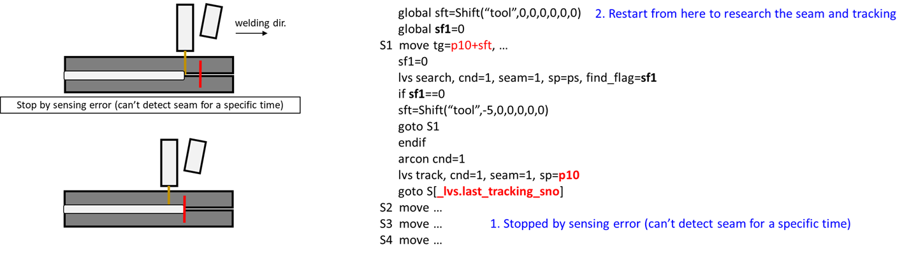
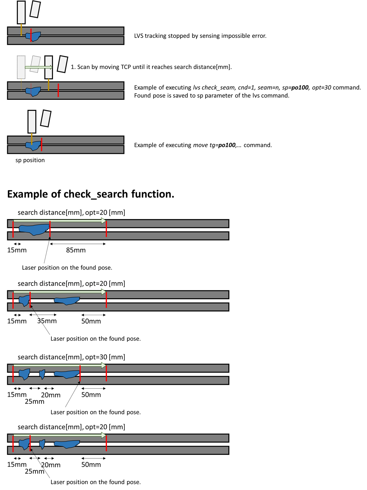

# 8.5.7 LVS Tracking Func. and Monitoring

### (1) LVS Tracking Overview

LVS Tracking is a function that compensates for the different between the taught trajectory and the actual welding line.


The reference teaching for the base workpiece should be performed with high precision.<br>
After applying the shift to correct the positioning error of the workpiece, the LVS function should be used.<br>
For further details, please refer to [8.5.5 LVS Master Mode Func.].


Since the laser is mounted in front of the TCP, a search must be performed first to carry out tracking.


  Please refer to the previous section, **[8.5.6 LVS Search Func.]**, for detailed information about the search function.



The configuration of the lvs command should be set as follows:

```python
    move L, spd=60%, accu=0, tool=1
    delay 0.3
    var po_100=cpo() # The current pose is stored in the variable po_100
    lvs search, cnd=1, seam=1, sp=po_100
    weavon cnd=1  
    arcon cnd=1
    lvs track, cnd=1, seam=1, sp=po_100
    move L, spd=30cm/min, accu=3, tool=1
    move L, spd=36cm/min, accu=3, tool=1
    move L, spd=40cm/min, accu=3, tool=1
    weavoff
    arcof
    end
```

When the search command is executed, it operates as follows depending on the option:

(1) Detect: Finds an invalid point as a starting point, saves it to sp, and then fills the data buffer while moving to the starting point.

(2) Above Laser: Fills the data buffer while the TCP moves to the laser position.

After the search, arc welding is performed while tracking the weld line in real time.

<br>
*그림 8.5.17. lvs search and tracking process*   
</br>

### (2) Teaching method for cases where tracking is interrupted due to an error in a section where the LVS is continuously unable to recognize during welding

The sp of the lvs track command stores the TCP position where the laser can be located at the last welding position.

If an error occurs because the LVS fails to recognize the weld line multiple times, it can be made to restart as follows.

The _lvs.last_tracking_sno system variable stores the step number being tracked.

<br>
*Figure 8.5.18. Manual restart method for unrecognized seam error*   
</br>

You can use the check_seam function to find a section that is recognized more efficiently than the method above.

This function finds a recognized point within the distance set in opt and saves it as a pose in sp.

<br>
*Figure 8.5.19. Description of check_seam function*   
</br>


### (3) How to use tracking with specified offset amount

```python
    move L, spd=60%, accu=0, tool=1
    delay 0.3
    var po_100=cpo() # The current pose is stored in the variable po_100
    lvs search, cnd=1, seam=1, sp=po_100
    weavon cnd=1  
    arcon cnd=1
    lvs track, cnd=1, seam=1, sp=po_100, side=5, height=-5 # offset tracking with 5mm in the ToolX, and -5mm in the ToolZ
    move L, spd=30cm/min, accu=3, tool=1
    move L, spd=36cm/min, accu=3, tool=1
    move L, spd=40cm/min, accu=3, tool=1
    weavoff
    arcof
    end
```


* When using weaving, the stickout length increases depending on the angle and amplitude. To compensate for this, set the height with a negative value during both search and track operations.


### (4) LVS Monitoring

You can switch screens for LVS monitoring by following the sequence `[(Right Panel) Creative Adjustments] - Select - LVS Follow`.

In monitoring, you can check the following items.

<br>
*Figure 8.5.19. LVS Monitoring*   
</br>


LVS Monitoring can be activated by selecting `[pane layout] - select - LVS tracking`.

In the monitoring, the follwing items can be checked:


| Item | Description |
|------|------|
| Total Cumulative Compensation<br> (X, Y, Z) | If weaving is not used, this represents the cumulative compensation relative to the base coordinate system. If weaving is used, it refers to the cumulative compensation in the weaving corrdinate syste. |
| Sensor | qual: Indicates whether the current laser seam sensing is valid or invalid.<br> Y, Z: The position of the currently sensed seam in the sensor image coordinate system(2D). |
| Tool Tip | The current position of the TCP relative to the base coordinate system. | 
| Tracking Point | The point that the TCP is currently tracking, relative to the base coordinate system. |
| Sensing Point | The base coordinate value of the location currently being sensed by the laser. |
| Buffer Size | The number of points stored in the buffer for tracking. If this value keeps increasing, decreasing, or reaches 0, there may be a problem with tracking, communication, or configuration. |
| Information | Displays the progress of the auto-calibration and other relevant information. |
| Real-time Image | Displays the points to be tracked, represented by red circles, that are stored in the buffer. |

