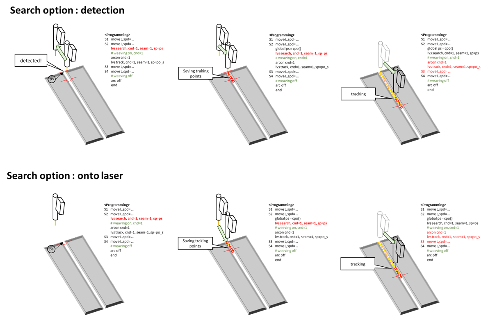
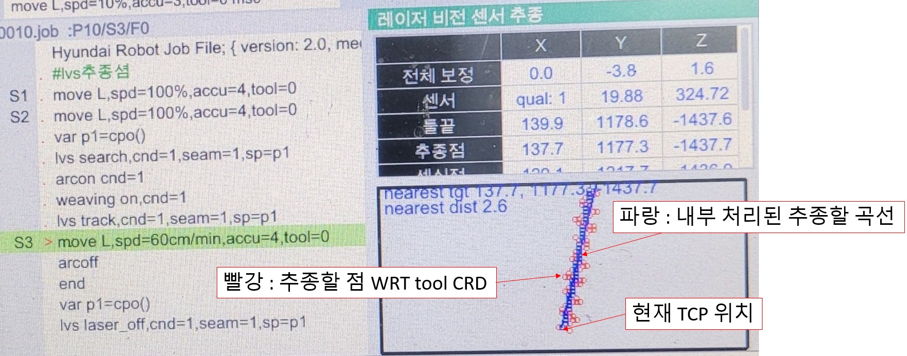

# 8.5.7 LVS(Laser Vision Sensor) tracking 기능과 모니터링

### (1) tracking 개요

LVS 트래킹은 티칭된 궤적과 실제 용접선의 차이를 보정해주는 기능입니다.


기준 작업물에 대한 기준티칭은 정밀하게 수행되어야 합니다.<br>
작업물의 위치 오차를 보정하기 위한 쉬프트를 적용한 후 LVS 기능을 사용하십시오.<br>
해당내용은 8.5.5 LVS master mode 기능을 참고하십시오.


레이저는 TCP보다 앞에 장착되어 있으므로 트래킹을 수행하기 위해서는 search 를 먼저 수행하여야 합니다. 


  search 기능에 대한 자세한 정보는 이전 장을 참고하시기 바랍니다.


LVS 명령어 구성은 다음과 같이 설정해야 합니다.

```python
  move L, spd=60%, accu=0, tool=1
  delay 0.3
  var po_100=cpo() #현재 포즈를 선언한 변수 po_100에 저장함
  lvs search, cnd=1, seam=1, sp=po_100
  weavon cnd=1  
  arcon cnd=1
  lvs track, cnd=1, seam=1, sp=po_100
  move L, spd=30cm/min, accu=3, tool=1
  move L, spd=36cm/min, accu=3, tool=1
  move L, spd=40cm/min, accu=3, tool=1
  weavoff
  arcof
  end
```

search 명령어 수행과정은 다음 그림과 같습니다. (탐색 유효, 방향 0 설정시)  
유효하지 않은 점을 시작점으로 찾아 sp에 저장한 후 시작점으로 이동하면서 데이터 버퍼를 채웁니다.

<p align="center">
 </img>
 <em><p align="center">그림 8.5.17. lvs search 과정</p></em>
</p>   
</br>


### (2) offset량을 지정한 tracking 사용법

만약 용접선(seam)을 정확히 추종하는 것이 아닌 좌우 또는 높이 offset을 두고 추종하고자 한다면 `lvs` 명령어의 side와 height에 
옵셋값을 mm 단위로 지정하면 됩니다. 이 때 옵셋값은 툴좌표계 방향으로 적용됩니다.

```python
move L, spd=60%, accu=0, tool=1
delay 0.3
var po_100=cpo() #현재 포즈를 선언한 변수 po_100에 저장함
lvs search, cnd=1, seam=1, sp=po_100
weavon cnd=1  
arcon cnd=1
lvs track, cnd=1, seam=1, sp=po_100, side=5, height=-5 #ToolX방향으로 5mm, ToolZ방향으로 -5mm 옵셋 트래킹
move L, spd=30cm/min, accu=3, tool=1
move L, spd=36cm/min, accu=3, tool=1
move L, spd=40cm/min, accu=3, tool=1
weavoff
arcof
end
```


* weaving을 사용할 경우 각도 및 진폭에 따라 stickout 길이가 길어지므로 search 및 track에 height를 -값으로 지정하여 이를 해소할 수 있습니다.



### (3) lvs 모니터링

lvs 모니터링은 **[창조정 > 선택 > LVS 추종]** 항목으로 활성화 할 수 있습니다.

모니터링에서는 다음과 같은 항목을 확인할 수 있습니다.

<p align="center">
 </img>
 <em><p align="center">그림 8.5.18. lvs 모니터링</p></em>
</p>   
</br>

<table>
  <thead>
    <tr>
      <th style="text-align:left">항목</th>
      <th style="text-align:left">설명</th>
    </tr>
  </thead>
  <tbody>
    <tr>
      <td style="text-align:left">
      전체 누적 보정량 (X, Y, Z)
      </td>
      <td style="text-align:left">
        위빙 미사용 시에는 base좌표계 기준 누적 보정량, 위빙 사용시에는 위빙 좌표계 기준 누적보정량을 의미합니다.
      </td>
      </td>
    </tr>
    <tr>
      <td style="text-align:left">
      센서
      </td>
      <td style="text-align:left">
      qual :  현재 레이저의 seam 센싱 무효,유효를 나타냅니다.<br> 
      Y, Z : 센서 이미지좌표계(2D)에서의 현재 센싱중인 seam의 위치입니다.
      </td>
    </tr>
    <tr>
      <td style="text-align:left">툴 끝</td>
      <td style="text-align:left">
        현재 TCP의 base좌표계 기준 위치 입니다.
      </td>
    </tr>
    <tr>
      <td style="text-align:left">추종점</td>
      <td style="text-align:left">
        현재 TCP가 트래킹하고 있는 base좌표계 기준 점입니다.
      </td>
    </tr>
    <tr>
      <td style="text-align:left">센싱점</td>
      <td style="text-align:left">현재 레이저가 보고있는 곳의 base좌표 값 입니다. </td>
    </tr>
    <tr>
      <td style="text-align:left">버퍼사이즈</td>
      <td style="text-align:left">따라갈 점들이 저장되어 있는 버퍼의 개수입니다. 이 값이 계속 늘어나거나 계속 줄어들거나 0이 되면 tracking, 통신 혹은 설정상에 문제가 있는 것 입니다.</td>
    </tr>
    <tr>
      <td style="text-align:left">정보</td>
      <td style="text-align:left">자동캘리브레이션 진행상황 및 기타 정보를 표시합니다. </td>
    </tr>
    <tr>
      <td style="text-align:left">실시간 이미지</td>
      <td style="text-align:left">빨간 원들을 버퍼에 저장된 따라갈 점들입니다.</td>
    </tr>
  </tbody>
</table>

