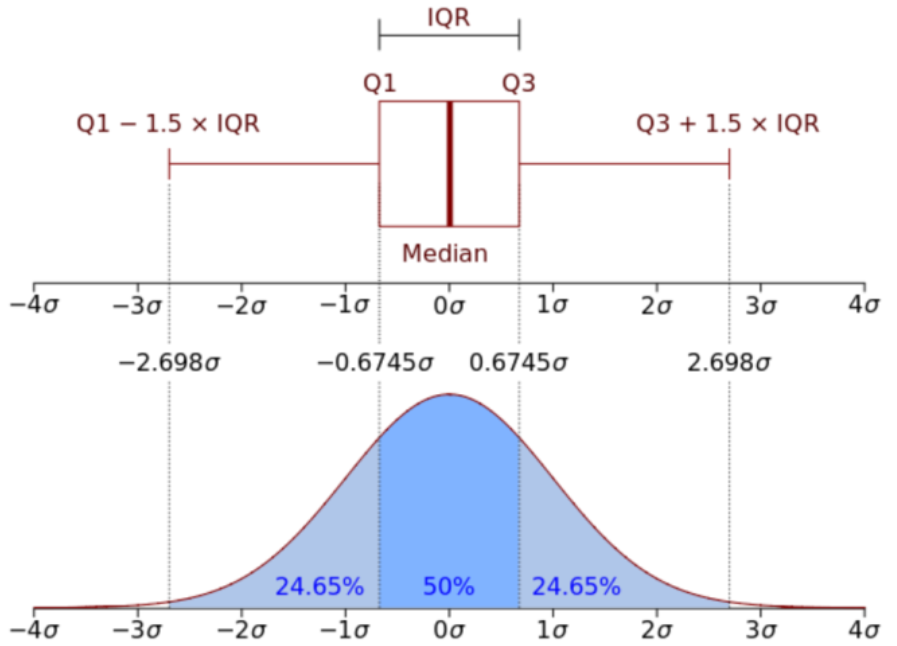

# 8.5.2 LVS(Laser Vision Sensor) TCP-센서 캘리브레이션

LVS기능을 사용하기 위해서 TCP와 센서좌표계 간 캘리브레이션이 선행되어야 합니다.
Hi6 제어기는 자동캘리브레이션을 지원합니다.
지금부터 해당 과정을 살펴보겠습니다.

1) 캘리브레이션 시편 준비
라이센스 구입시 시편을 제공합니다. 
테스트용도로 우선 사용하고자 한다면 당사에 문의하여 캘리브레이션 시편을 준비하십시오.

2) 명령어 입력
다음 그림과 같이 [명령입력]-[arcweld]-[lvs] 를 입력하여 티칭하십시오.

 </img>
 <em>
그림 8.19 LVS 자동 캘리브레이션 티칭
</em>

이때 seam 인자는 LVS제어기에 등록한 형상정보 데이터베이스의 번호입니다.

3) 시편의 기준점에 TCP를 조그로 이동시키십시오. 
이때 TCP의 자세는 시편과 수직으로 위치해야 합니다. (Roll, Pitch 방향 모두 수직)
또한 레이저 라인은 되도록 시편과 수직이 되도록 위치 하십시오.

4) 자동모드로 재생합니다.
이때 lvs 모니터링을 열어서 테이블의 info 항목에서 캘리브레이션이 모두 끝나면 표시가 됩니다.