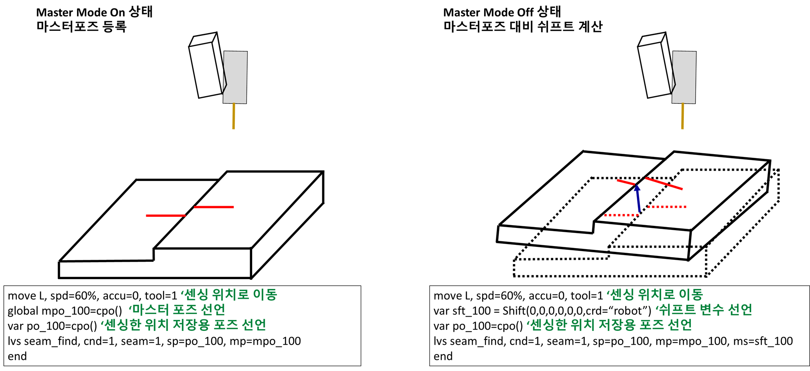

# 8.5.5 LVS(Laser Vision Sensor) master mode 기능

(1) master mode 개요

master mode 기능은 마스터포즈(기준위치)을 저장해 놓고 실제 양산 시 기준 위치 대비 쉬프트량을 구하는 기능입니다.
이를 위해서는 사용자키 - master mode를 활성화 하여 마스터포즈(기준위치)를 미리 등록해 두어야 합니다.

 </img>
 <em>
그림. 마스터모드와 실제 기동시의 동작의 예
</em>

   
 

위 그림의 왼쪽과 같이 마스터모드를 활성화 한 상태에서 마스터포즈를 저장합니다.
일반적으로 master mode를 on 한 상태에서 여러 부재들에 대해 마스터 티칭을 완료합니다.
후판용접에서는 대략 수십개의 용접 경유점들이 마스터포즈로 등록될 것입니다.

그 후 양산 시에는 마스터모드를 off한 상태에서 로봇을 반복기동하여 용접작업을 수행합니다.
이 때, lvs명령어의 ms 인자에 지정된 shift 변수에 마스터포즈 대비 현재 센싱한 포즈와의 shift가 자동으로 계산되어 저장됩니다.

(2) 마스터모드 대비 쉬프트량 검사 기능
마스터포즈 대비 현재 센싱한 포즈의 쉬프트량이 사용자가 설정한 범위 내에 존재하는지 검사할 수 있습니다.
범위 설정은 lvs 명령어에서 [속성]창에 진입하여 seam finding parameter 항목의 distance from reference position 항목에 [mm] 단위로 기입합니다.
seam finding 수행시 shift량이 사용자가 설정한 범위를 벗어난다면 에러가 발생합니다.

(3) 센서 이미지를 이용한 에러검출 기능 (scansonic 센서만 지원)
기준 위치에서의 센싱 프로파일 이미지 (LVS 센서가 보는 이미지)를 현재 센싱한 이미지와 비교하여 에러를 검출할 수 있습니다. 

