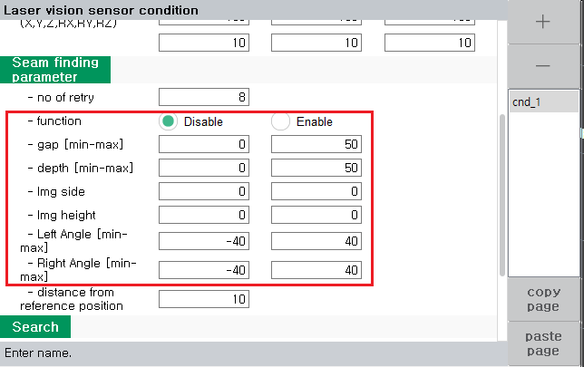

# 8.5.4 LVS(Laser Vision Sensor) seam finding 기능

(1) Seam finding 기능의 개요

LVS는 seam finding 기능을 제공합니다. 

이 기능은 센싱한 위치를 포즈로 저장하는 기능으로 터치센싱 대용으로 사용 가능합니다.

주의 : 기능 사용전 TCP-센서 캘리브레이션이 수행되어 있지 않으면 비정상적인 포즈가 저장됩니다.

명령어 형식은 다음과 같습니다.

```python
var po_100=cpo() #현재 포즈를 선언한 변수 po_100에 저장함
lvs seam_find, cnd=1, seam=1, sp=po_100
```

위 명령어를 수행하면 po_100 변수에 센싱한 자세에서 lvs로 센싱한 위치(x,y,z)가 저장됩니다.

즉, 아래 그림과 같이 센싱 전 툴의 자세에 따라 저장된 포즈에서의 자세가 결정됩니다.

<p align="center">
 </img>
 <em><p align="center">그림. lvs 센싱 자세에 따른 포즈에서의 자세</p></em>
</p>   
</br>

만약 센싱 전 자세와 상관없이 포즈에 위치만 저장하고 싶다면 다음과 같은 명령어 형식을 이용합니다.

이 기능은 포즈에 용접자세를 기록해 놓은 뒤 위치(X,Y,Z) 만 lvs로 센싱한 점으로 계산하고자 할때 유용하게 사용 할 수 있습니다.


```python
var po_100=cpo() #현재 포즈를 선언한 변수 po_100에 저장함
lvs seam_find_p, cnd=1, seam=1, side=10, height=10, sp=po_100
```


센싱한 위치에서 센싱시 툴의 자세 방향으로 쉬프트한 포즈는 다음과 같이 티칭할 수 있습니다.

이 기능은 센싱 위치에서 쉬프트를 적용해 포즈를 계산하고자 할 때 유용하게 사용할 수 있습니다.

```python
var po_100=cpo() #현재 포즈를 선언한 변수 po_100에 저장함
lvs seam_find, cnd=1, seam=1, side=10, height=10, sp=po_100
```

위 명령어는 센싱한 위치에서 센싱시 툴의 자세로 tool_y 방향으로 10mm, tool_z 방향으로 10mm 이동된 포즈를 계산합니다.


(2) Seam finding 시 파라미터 검사기능

seam finding시 현재 lvs센서가 보고있는 seam의 형상에서 사용자가 설정해놓은 범위내에 각종 수치가 존재하는지 판단할 수 있습니다.

수치는 gap, depth, side, height, left angle, right angle 등을 의미하며 다음 그림과 같습니다.

<p align="center">
 </img>
 <em><p align="center">그림. seam finding 파라미터의 의미</p></em>
</p>   
</br>

이 기능을 이용하면 로봇의 위치 비정상, 부재의 형상 비정상을 미리 판단하므로 용접 전에 미리 불량을 탐지하고 방지할 수 있습니다.

lvs 명령어에서 [속성] 창에 진입하면 seam finding parameter항목에 아래 그림과 같이 사용자가 수치의 범위를 설정합니다.

<p align="center">
 </img>
 <em><p align="center">그림. seam finding parameter 검사기능의 설정</p></em>
</p>   
</br>

seam finding 수행 시 이 설정범위를 벗어나면 에러가 발생합니다.

(3) lvs seamfinding 재시도 기능

seam finding을 수행하였는데 센서에서 seam 인식이 불가능하다면 재시도를 수행합니다.

재시도 횟수는 seam finding parameter의 no of retry 항목에 기입합니다.

재시도 횟수만큼 센싱을 시도하여도 센싱이 불가능할 경우 에러가 발생합니다.

재시도는 다음과 같은 위치로 이동하면서 수행합니다.

<p align="center">
 </img>
 <em><p align="center">그림. seam finding 재시도 기능</p></em>
</p>   
</br>