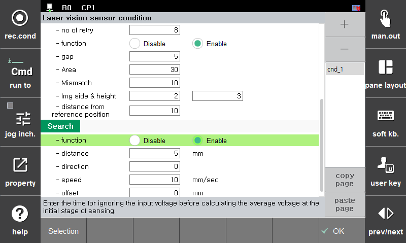
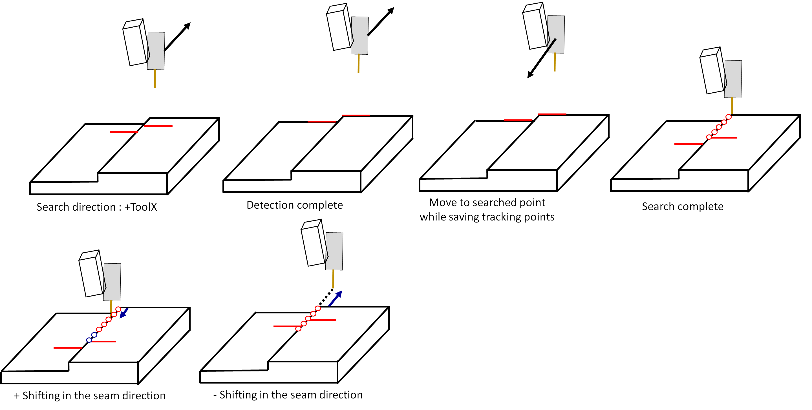

# 8.5.6 LVS(Laser Vision Sensor) search 기능

(1) Search 기능의 개요

LVS는 search 기능을 제공합니다.

search는 다음과 같은 목적으로 사용합니다.

[1] 시작점 또는 종료점 포즈 찾기

[2] 시작점 또는 종료점의 위치로 이동하면서 따라갈 위치를 버퍼에 저장

search를 수행하면 탐색이 수행되고 탐색이 완료되면 해당 위치로 이동하면서 버퍼에 따라갈 위치를 저장합니다.

search는 다음과 같이 사용합니다.

```python
move L, spd=60%, accu=0, tool=1
delay 0.3
var po_100=cpo() #현재 포즈를 선언한 변수 po_100에 저장함
lvs search, cnd=1, seam=1, sp=po_100
```

lvs 명령어에서 [속성]에 진입하면 다음과 같이 search 설정을 수행할 수 있습니다.


<p align="center">
 </img>
 <em><p align="center">그림. lvs search 설정화면</p></em>
</p>   
</br>

(1) function
 
 search 기능의 사용을 설정합니다.
 
 미사용일 경우 lvs가 보고있는 위치로 바로 이동하면서 버퍼에 목표위치들을 저장합니다.
 
 사용일 경우 탐색방향으로 시작점과 종료점을 검출한 후 검출한 위치로 이동하면서 버퍼에 목표위치들을 저장합니다.

(2) direction
 
 0 일 경우 +ToolX 방향으로 탐색합니다.

 1 일 경우 -ToolX 방향으로 탐색합니다.

(3) speed
 
 탐색 속도를 mm/sec 단위로 설정합니다.

(4) offset

 탐색점에서 용접선 방향으로 찾은 점을 설정한 mm 만큼 쉬프트시킬 수 있습니다.


<p align="center">
 </img>
 <em><p align="center">그림. lvs search 예시</p></em>
</p>   
</br>


search 기능을 수행하면 tracking을 수행할 수 있는 상태가 됩니다.

다음과 같이 tracking을 티칭할 수 있습니다.

```python
move L, spd=60%, accu=0, tool=1
delay 0.3
var po_100=cpo() #현재 포즈를 선언한 변수 po_100에 저장함
lvs search, cnd=1, seam=1, sp=po_100
weavon cnd=1
arcon cnd=1
lvs track, cnd=1, seam=1
move L, spd=30cm/min, accu=3, tool=1
move L, spd=36cm/min, accu=3, tool=1
move L, spd=40cm/min, accu=3, tool=1
weavoff
arcof
end
```