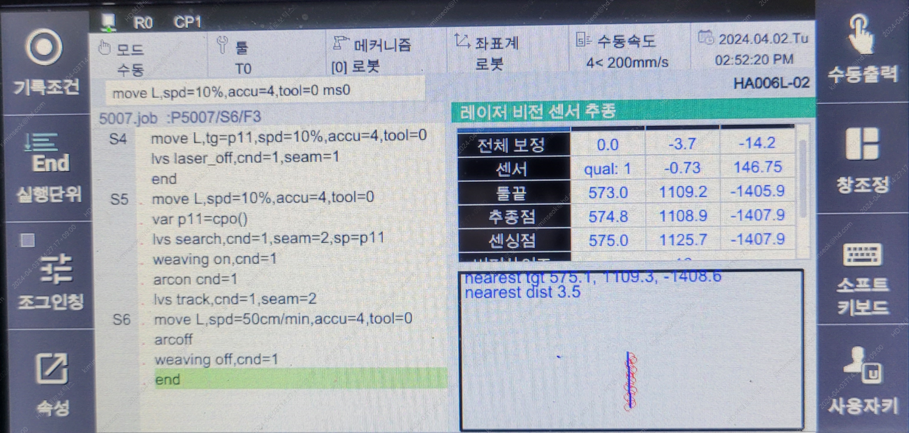

# 8.5.7 LVS(Laser Vision Sensor) tracking 기능과 모니터링

(1) tracking 개요

LVS로 tracking을 하려면 search가 선행되어야 합니다.

search는 시점(또는 종점)을 찾고 그 위치로 이동하면서 따라갈 점들을 버퍼에 저장하기 때문입니다.

search 무효일 경우 명령어 실행 시 레이저가 보고있는 위치로 이동하며 버퍼를 채웁니다.

search 유효일 경우 조건에 설정한 탐색방향(ToolX 또는 -ToolX방향)으로 이동하면서 시점(또는 종점)을 찾고 찾은 위치로 이동하면서 버퍼를 채웁니다.

따라서 LVS명령어의 구성은 다음과 같이 구성하여야 합니다.

```python
move L, spd=60%, accu=0, tool=1
delay 0.3
var po_100=cpo() #현재 포즈를 선언한 변수 po_100에 저장함
lvs search, cnd=1, seam=1, sp=po_100
weavon cnd=1  
arcon cnd=1
lvs track, cnd=1, seam=1
move L, spd=30cm/min, accu=3, tool=1
move L, spd=36cm/min, accu=3, tool=1
move L, spd=40cm/min, accu=3, tool=1
weavoff
arcof
end
```

(2) offset량을 지정한 tracking 사용법

만약 용접선(seam)을 정확히 추종하는 것이 아닌 좌우 offset이나 높이 offset을 두고 추종하고자 한다면 lvs 명령어의 side와 height에 
옵셋값을 mm 단위로 지정하면 됩니다. 이 때 ofsset량은 툴좌표계 방향으로 적용됩니다.

```python
move L, spd=60%, accu=0, tool=1
delay 0.3
var po_100=cpo() #현재 포즈를 선언한 변수 po_100에 저장함
lvs search, cnd=1, seam=1, sp=po_100
weavon cnd=1  
arcon cnd=1
lvs track, cnd=1, seam=1, side=5, height=-5 #ToolX방향으로 5mm, ToolZ방향으로 -5mm 옵셋 트래킹
move L, spd=30cm/min, accu=3, tool=1
move L, spd=36cm/min, accu=3, tool=1
move L, spd=40cm/min, accu=3, tool=1
weavoff
arcof
end
```

(3) lvs 모니터링

lvs모니터링은 [창조정]-[분할]-[lvs 모니터링] 항목으로 활성화 할 수 있습니다.

모니터링에서는 다음과 같은 항목을 확인할 수 있습니다.

<p align="center">
 </img>
 <em><p align="center">그림. lvs 모니터링</p></em>
</p>   
</br>

[1] 전체 누적 보정량 (X, Y, Z) : 위빙 미사용 시에는 base좌표 기준 누적 보정량, 위빙 사용시에는 위빙좌표계 기준 누적보정량을 의미합니다.

[2] 센서 : qual은 센싱 무효,유효를 나타내며 Y, Z 값은 센서 이미지좌표계(2D)에서의 현재 센싱중인 seam의 위치 좌표입니다.

[3] 툴끝 : 현재 TCP의 base좌표 입니다.

[4] 추종점 : 현재 TCP가 트래킹하고 있는 점입니다.

[5] 센싱점 : 현재 레이저가 보고있는 곳의 base좌표 값 입니다.

[6] 버퍼사이즈 : 따라갈 점들이 저장되어 있는 버퍼의 개수입니다. 이 값이 계속 늘어나거나 계속 줄어들거나 0이 되면 tracking, 통신 혹은 설정상에 문제가 있는 것 입니다.

[7] 정보 : 자동캘리브레이션 진행상황 및 기타 정보를 표시합니다.

[8] 실시간 이미지 : 빨간 원들을 버퍼에 저장된 따라갈 점들이며 파란선은 현재 TCP에서 지금 센싱한 위치를 이은 직선입니다.
