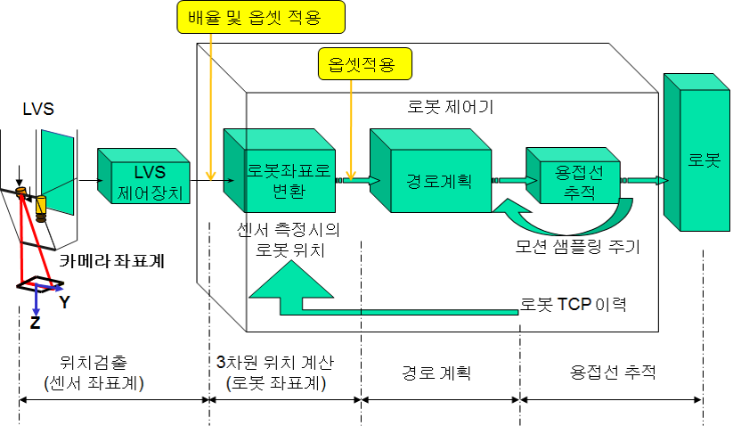
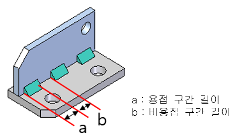

# 8.6. LVS기반 용접조건 가변 기능

본 기능은 LVS로 측정한 gap의 너비를 기반으로 용접 전류, 전압을 변경할 수 있는 기능입니다. LVS로 용접선 추적 중 측정된 gap을 기반으로 용접 조건을 최적화 합니다. 작업물에 열 변형이 있어 용접선의 gap이 일정하지 않을 경우 gap에 따라 용접조건을 변경하여 안정적인 용접 품질을 얻을 수 있도록 본 기능을 제공합니다.

 </img>
 <em>
그림 8.18 LVS기반 용접조건 가변 기능
</em>

최적의 용접 조건을 찾기 위해 미리 설정된 조건을 이용하며, 그것을 위한 사용자 인터페이스를 제공합니다.

 </img>
 <em>
그림 8.19 최적 조건 설정을 위한 사용자 인터페이스(좌: 테이블 설정방식, 우: 관계식 설정방식)
</em>

 

LVS기반 용접조건 가변 기능에서 가변 조건을 설정하기 위해서는 사전 조건을 획득해야 합니다. 사전 조건 획득은 본 기능을 적용하려는 환경에서 gap에 적합한 용접조건을 적용 전에 찾는 것을 의미합니다. Gap에 따라 실제 용접 후 사전조건을 획득하여 제공하는 사용자 인터페이스에  입력하면 됩니다. 본 기능을 설정하기 위해 테이블 설정방식과 관계식 설정방식을 제공합니다. 테이블 설정방식은 최소 2개에서 6개의 사전 조건을 입력하여 입력된 조건들 사이를 직선 보간하여 입력된 gap에 맞는 용접조건으로 변경합니다. 관계식 설정방법은 위와 마찬가지로 2개에서 6개의 사전 조건을 입력하고, 입력된 조건들 사이를 곡선 보간하여 입력된 gap에 맞는 용접조건으로 변경합니다.

 </img>
 <em>그림 8.20 설정 방법에 따른 조건 변화</em>
 

 </img>
 <em>
그림 8.20 설정 방법에 따른 조건 변화
</em>

