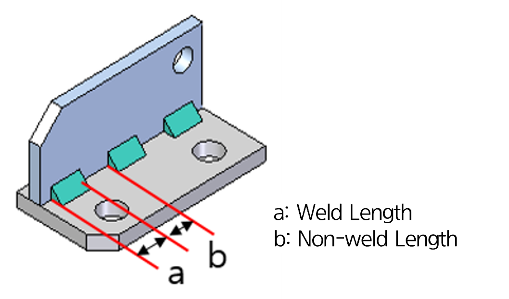
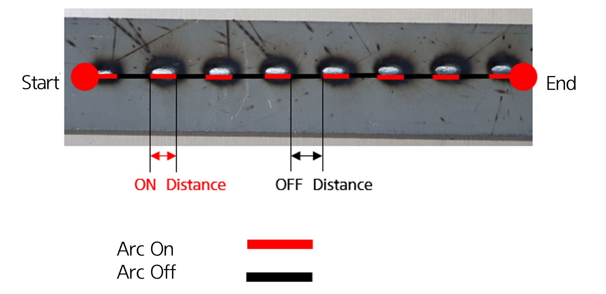
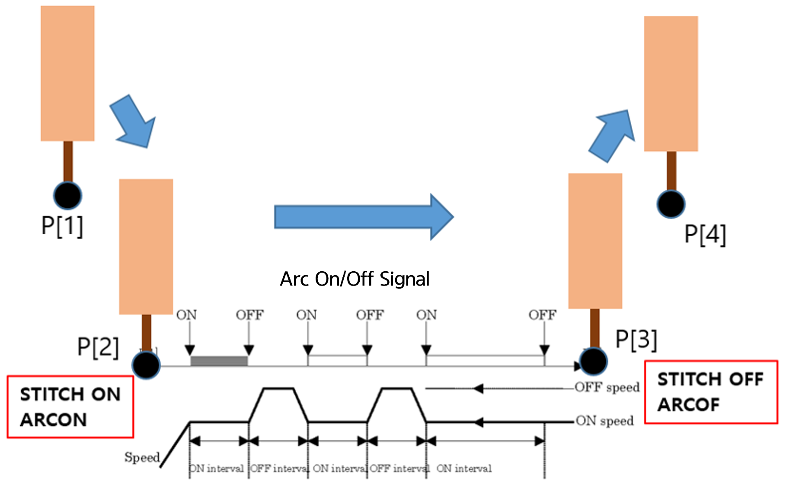

# 8.6.1  STITCH Func. Overview

Stitch welding is a function where welding is performed intermittently, similar to stitching. In [Figure 8.6.2], stitch welding is performed by setting start and end points on the specimen. In stitch welding, parameters `a` and `b` are set as shown in [Figure 8.6.1] to determine the length of the welding section and the non-welding section, thus forming the stitch pattern.

[Figure 8.6.3] provides a simple explanation of the stitch welding process. Positions from P[1] to P[4] are recorded. In this diagram, stitch welding is performed at the P[2] and P[3] sections, using the commands ```stitch on/off``` and ```arcon/arcoff```.

</br>

<p align="center">
 </img>
 <em><p align="center">Figure 8.6.1. Stitch Func. basic parameter</p></em>
</p> 

</br>


<p align="center">
 </img>
 <em><p align="center">Figure 8.6.2. Stitch Welding specimen</p></em>
</p> 
 
</br>


<p align="center">
 </img>
 <em><p align="center">Figure 8.6.3. Stitch Welding Process</p></em>
</p> 


 


