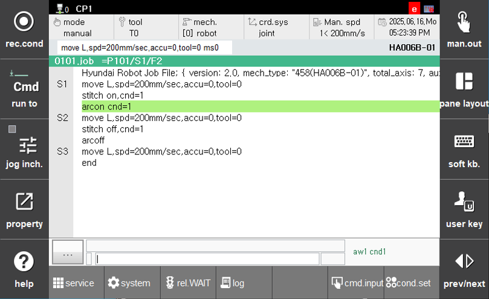

# 8.6.2 STITCH Func. Command

<br>
*图 8.6.4. 缝合命令示例*  

```stitch``` 命令: 
在顺序中选择 `[F6: 命令输入] - arcweld - stitch ([F6: cmd.input] - arcweld - stitch)` 后，选择开/关并按 **[ENTER]**。


- ```S2 move L, spd=10mm/s, accu=3, tool=1```  
	- L : 确保选择线性插值。  
	- 200mm/sec : 焊接速度 - 在缝合焊接的开部分的速度。单位必须设置为 mm/sec
- ```arcon / arcoff``` 一起使用命令以开始焊接。
