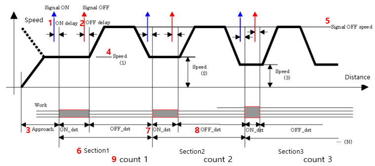
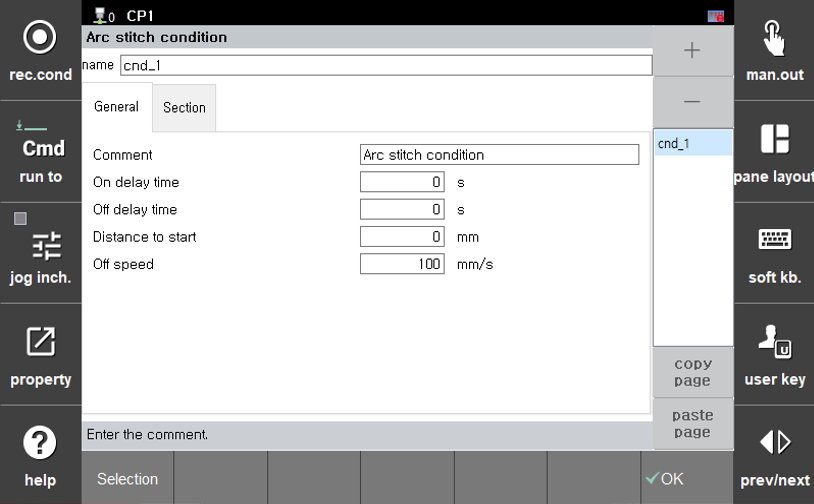
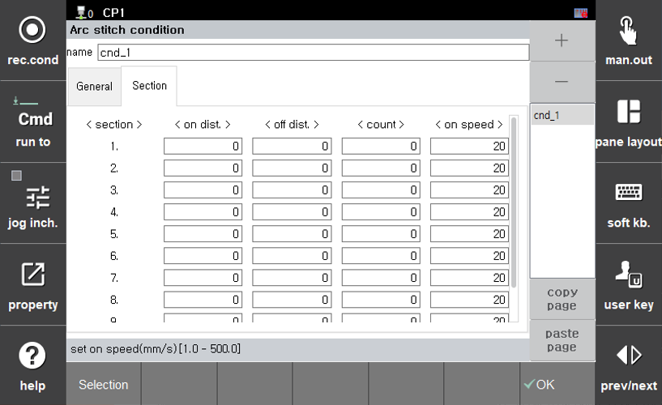

# 8.6.3 STITCH Func. Parameter setting

 </img>
 <em>
Figure 8.6.5. Stitch Welding Process Profile
</em>

[그림 8.6.5]는 스티치 용접 과정을 보여줍니다. 이 차트에 따라 `stitch` 명령어의 옵션들을 설정할 수 있습니다.

[Figure 8.6.5] illustrates the stitch welding process. Based on this chart, you can configure the options for the `stitch` command.

 </img>
 <em>
Figure 8.6.6. Stitch Welding Condition Dialog Box1 (General)
</em>

 </img>
 <em>
Figure 8.6.7. Stitch Welding Condition Dialog Box2 (Section)
</em>

[그림 8.6.6]은 `stitch` 명령어에 커서를 두고 TP 좌측 화면에서 [**속성**] 버튼을 눌러 접근할 수 있습니다. [그림 8.6.7]은 이전 화면에서 [**구분**] 탭을 눌러 접근합니다. 각 그림에 대한 파라미터 설명은 다음과 같습니다.

[Figure 8.6.6] shows the screen accessed by placing the cursor on the `stitch` command and pressing the [**Property**] button on the left side of the TP screen. [Figure 8.6.7] is accessed by selecting the [**Section**] tab from the previous screen.
The descriptions of the parameters for each figure are as follows:

- Condition Number: Select from the list of conditions on the right
- Description: Input using the soft keyboard
- General
  - (1) On delay Time: The time period during which the welding signal is turned on in advance
  - (2) Off delay Time: The time period during which the welding signal is turned off in advance
  - (3) Distance to Start: The length of the speed entry section before the stitch welding starts(On section)
  - (4) Off Speed: Welding Speed during the non-overlapping (Off) section

- Section
  - (5) Section: Stitch welding condition   
    Example. When stitch welding under the conditions of section 1 is performed for the specified count, stitch welding proceeds under the conditions of section 2
  - (6) On Distance: Length of the welding section
  - (7) Off Distance: Length of the non-overlapping (Off) section
  - (8) Count: Number of stitch welding repetitions
  - (9) On speed: Welding speed during the welding section

- Input/Output
  - (10) Stitch Enable
  - (11) Equipment Enable
  - (12) Equipment Output   
    → All three parameters must be set to 1 for stitch welding to proceed during playback


- **(6) on dist, (7) off dist, (8) count**: All of these must be entered to set the conditions for section2.
- **(9) on speed**: The speed for the welding (ON) section in the stitch section is set as the step speed.
- **(11) Stitch Enable Port, (12) Equipment enable Port, (13) Equipment Output Port**: All must be set to 1 for the stitch welding welding to proceed during playback. If not set, welding will not occur, and only the stitch motion will proceed.


