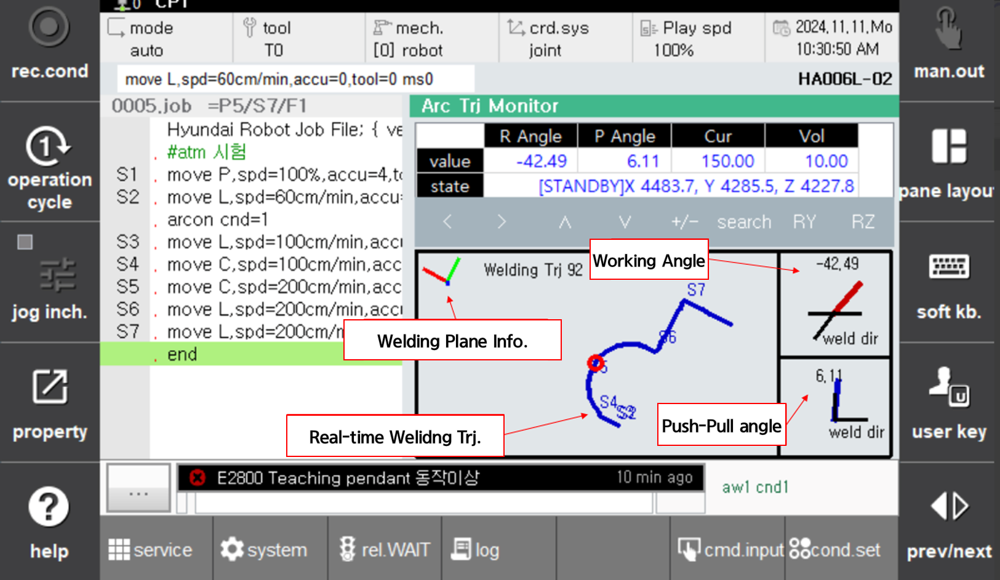

# 8.7 Arc Trajectory Manager

This features displays the trajectory, current, voltage, and torch position (welding angle, push-pull angle) in real-time during arc welding.

Through this, you can monitor the welding angle, current, and voltage in real time during arc welding, making it easier to modify the welding teaching later.

To enable this feature, follow these steps:

Set "Arc trajectory monitoring" to 'activation on' under `[System] - 2: Application parameter - 2: Arc welding`.


This feature is available during from version 60.30-00.


 
*Figure 8.7.1. Real-time Arc trajectory monitoring*

You can monitor the trajectory and welding information in real-time from the `arcon` to the `arcoff` section.

Use the arrow keys to move the plane, or press **[Shift] + [+/-]** keys to zomm in or out.

The welding angle and push/pull angle are calculated base on the welding direction relative to the welding plane.


The welding plane automatically rotates according to the welding trajectory.


