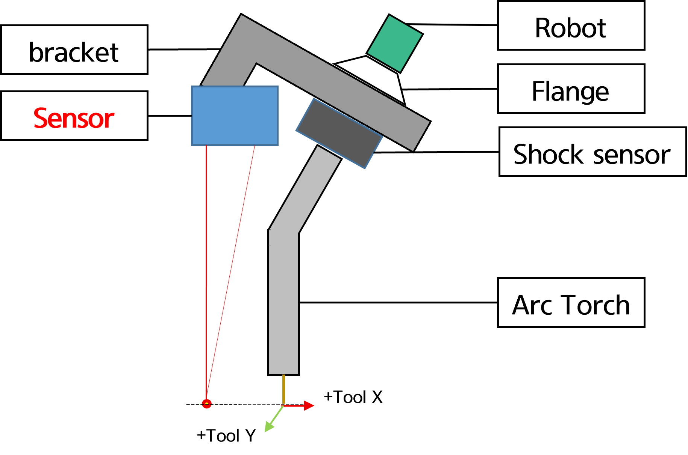
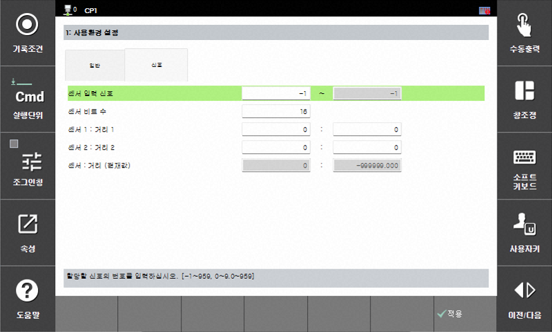



# 8.7.1 Laser Sensor Setup  

To use the LPS function, it is necessary to first install the laser sensor and configure communication specifications and related settings.
 

### (1) Mounting the Laser Sensor Using a Connection Bracket

The connection bracket may be designed and fabricated by the user, or provided by our company or the sensor manufacturer.

 
*Figure 8.7.1. Installation of the laser sensor using a bracket*

A laser distance sensor consists of a transmitter and a receiver.
When the robot is aligned with the arc torch, ensure that the transmitter/receiver of the laser sensor is aligned with the tool-based X direction (refer to the laser manufacturer's specifications).
In addition, it is recommended to install the sensor on the right side of the tool Y direction (right side when facing the torch).  

When the laser is installed and powered on, keeping the distance between the tool tip and the laser point as short as possible is advantageous in terms of interference prevention and CT (Cycle Time).
Finally, the sensor installation position relative to the tool tip must be suitable for the specifications of the laser sensor being used (measurement range), and should be installed higher than the minimum specified distance.


  It is recommended to mount the sensor bracket directly to the robot flange. In other words, install the mechanical structure in the following order: **Flange - Laser sensor and bracket - Shock sensor - Torch.**


### (2) Communication Setup

The laser sensor can be connected according to its specifications by referring to the following link.
(Refer to [${cont_model} - Industrial Communication](https://hrbook-hrc.web.app/#/view/doc-industrial-communication/en-${cont_model}/README?cont_model=${cont_model}))

This page describes examples for selected sensors only.

* Before proceeding with the setup, connect the sensor head, controller, communication unit (if applicable), and SMPS, and then supply power.
(If the connection order is incorrect, sensing values may not be received. Therefore, ensure that the sensor is connected first during subsequent setups as well.)

#### Serial - Example: Keyence LK-G400

First, configure the sensor controller settings.

* Communication Speed Setting (Required)  
1. Press and hold the `SET` key, then press the `[UP]` key to select `Enu`.
2. Press the `ENT` key and use the `[RIGHT]` key to select function `A` (RS-232C).
3. Press the `ENT` key to check the current value (A-b0 to b4; 9600 / 19200 / 38400 / 57600 / 115200).

* Display Unit Setting (Optional)  
1. Press and hold the `SET` key, then press the `[UP]` key to select `oUt-1`.
2. Press the `ENT` key and use the `[RIGHT]` key to select function `G`.
3. Press the `ENT` key and use the `[UP]` key to set the desired number of decimal places (G-0 to ; 0.01, 0.001, ...).

Navigate to `[F2: System] - 4: Application Parameters - 6: Laser Point Sensing - 1: Environment Setting`.

 
*Figure 8.7.2. Laser Communication Setup (Keyence LK-G)*
 

Select Keyence as the LPS brand to configure the settings.
Once the setup is complete, verify that the value displayed in the **Sensing Distance (mm)** field matches the output value from the controller.

 

#### EtherNet/IP - Example: Baumer OM-70

Connect the sensor to a PC and access the web interface.
(The default fixed IP address is 192.168.0.250.)

 
*Figure 8.7.3. Baumer Sensor Web Configuration*
   

Navigate to `Device Configuration` tab and set the communication method according to the intended purpose.
At this time, enable only the method that matches the currently used communication protocol in the Process Interface section.

If **Ethernet/IP** is used, complete the network settings accordingly. In the ${cont_model}, network ranges 0, 1, and 2 are used by default, so a different range must be assigned. (e.g. 192.168.10.250.)

 
*Figure 8.7.4. Baumer Sensor Network Settings*
    

Afterward, proceed step by step by following the link below.
Note that Hi6 does not support built-in Ethernet, so a communication card must be used ([Hi6 - Industrial Communication](https://hrbook-hrc.web.app/#/view/doc-industrial-communication/en-Hi6/1-cifx-pci-communication/3-cifx-pci-settings-industrial-communication/3-EtherNet-IP/README?cont_model=Hi6)).
From Hi7 and later, built-in Ethernet is supported, allowing communication to be established using the controller alone ([Hi7 - Industrial Communication](https://hrbook-hrc.web.app/#/view/doc-industrial-communication/en-Hi7/2-ethernet-ip/4-scanner/README?cont_model=Hi7)).

 
*Figure 8.7.5. Baumer Sensor Signal Assignment*
 

Once the above steps are completed, navigate to `[F2: System] - 4: Application Parameters - 6: Laser Point Sensing - 1: Environment Setting - Signal tab`.
Configure the input signals for the assigned blocks.
You can then confirm that the distance (current value) is output as the sensor value. (Additional settings are required if sensor-to-distance mapping is needed.)

#### EtherNet/IP - Example: Keyence IL-300

* Refer to the manufacturer's manual and our manual to connect the sensor in the same manner as the Baumer sensor.
As described above, the Ethernet connection method differs depending on whether an Hi6 or Hi7 controller is used.
