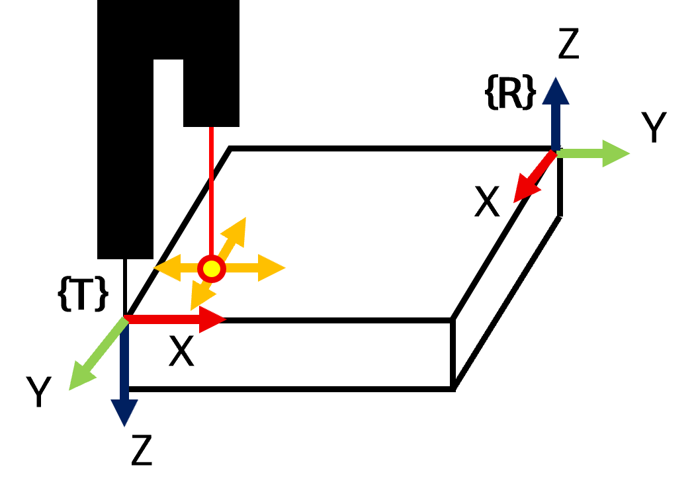
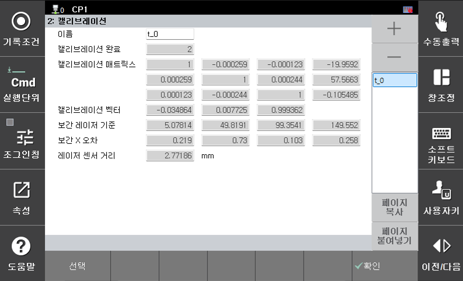

# 8.7.2 TCP-传感器校准  

在使用LPS功能之前，必须对TCP和传感器进行校准。  
以下部分描述如何执行TCP到传感器的校准。

<br/>

### (1) 校准样本的准备  

当通过我公司购买许可证时，将提供用于自动校准的校准样本。

<br/>

### (2) 准备  

在执行校准之前，工具必须与校准平面完美对齐。  
根据工具坐标系手动教导工具在X和Y方向上的位置，并检查激光输出保持不变（误差保持在0.5或更低）。根据需要调整RX和RY值。  

工具对齐后，将线缆尖端放置在校准平面的边缘。  
在工具基础的X-Y方向上进行教学时，调整RZ值，使激光点沿着边缘角移动。  

<br/>

<br>
*图8.7.2.1 校准前的准备*<br/>  

完成上述步骤后，进行校准所需的所有准备工作已完成。

### (3) 执行自动校准  

将线缆尖端放置在校准平面的一个顶点。  
此外，确保激光点位于校准平面内部。  

<br/>

<br>
*图8.7.2.2 校准开始*<br/>  

从下方面板中选择`[F6: cmd. input] - arcweld - lps`并插入以下命令。

```py
  lps auto_calib, cnd=<Condition Number>, Tx=<Movement Distance in the X-dir based on the tool>, Ty=<Movement Distance in the Y-dir based on the tool
```

此时，移动距离必须设置为大于激光所需移动的距离。  
如果在指定参数内检测失败，将发生校准错误。  

在自动方式下执行时，校准通过以下操作序列进行：  

1. 激光点向Tx和Ty方向移动，最初朝向工具尖端方向移动。  
2. 根据机器人坐标系，机器人在+Z方向上抬起，并执行与步骤1相同的过程。  
3. 根据机器人坐标系，机器人在-Z方向上向下移动，同时向传输/接收器方向进行插值（当前支架规格Tx）。  

校准完全完成后，步骤左侧出现执行标记，所有运动停止。  

### (4) 校准信息  

导航到`[F2: 系统] - 4: 应用参数 - 6: 激光点传感 - 2: 校准 ([F2: System] - 4: Application Parameters - 6: Laser Point Sensing - 2: Calibration)`以检查校准结果。  
当**校准完成**字段中的值变为“2”时，表示所有校准过程，包括插值，已完成。  
校准信息是按工具编号存储的，这在使用工具更换功能时非常有用。  
如果工具信息相同，但要使用不同的工具编号，则可以复制并重用校准数据。

<br/>

<br>
*图8.7.2.3 校准结果*<br/>