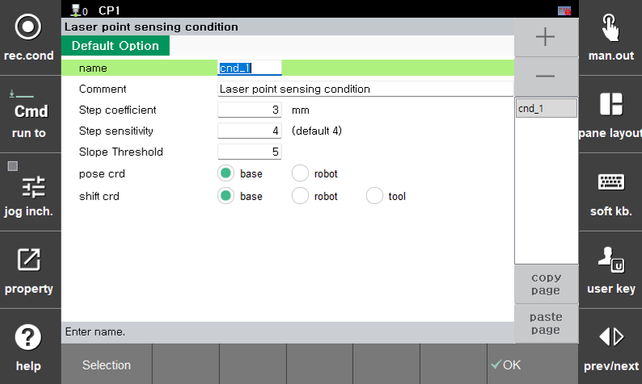
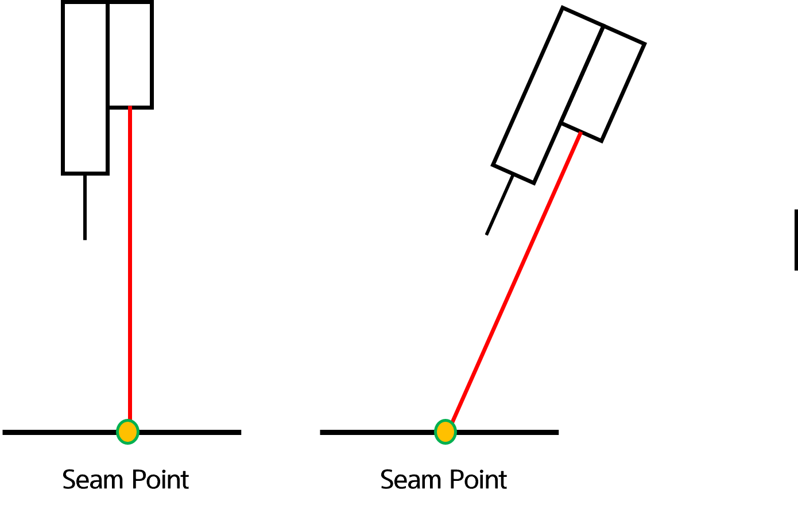
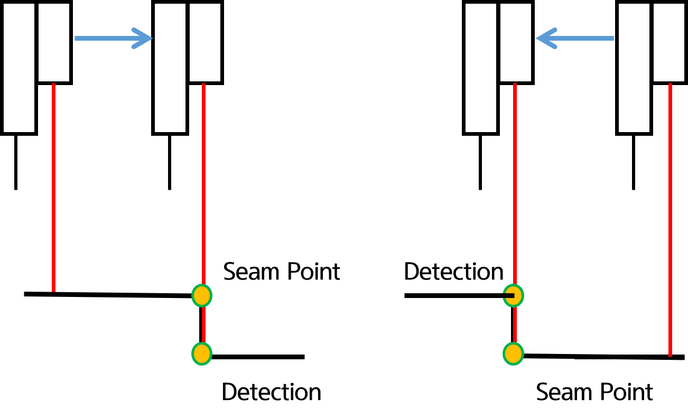
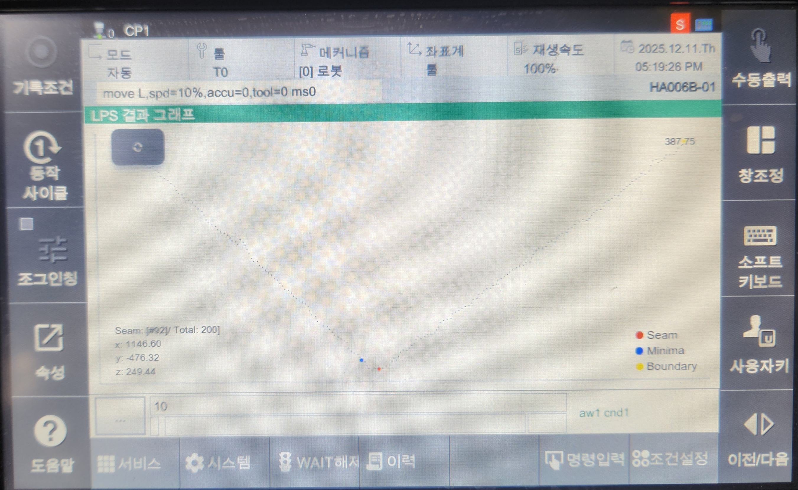
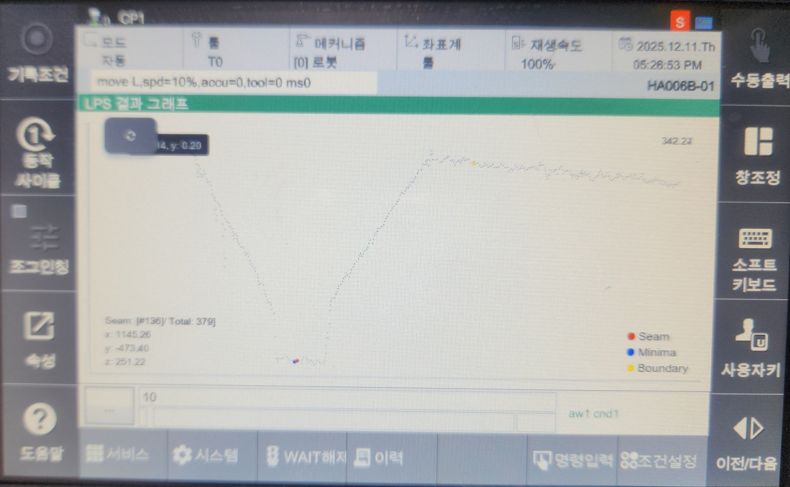

# 8.7.3 使用 LPS 功能  


如果在使用此功能之前未执行工具与传感器的校准（参见 8.7.2），可能会存储无效的姿态。


### 属性窗口

LPS 命令的属性如下。  
<br/>

<br>
*图 8.7.3.0 LPS 属性*<br/>  

#### 间隙系数

此参数用于在 **步进模式 (stepp)** 中检测步骤差异，并允许用户指定检测到的高度差。  
但是，在校准过程中不使用此参数，因为使用了单独的校准样本。

#### 步骤灵敏度

此参数根据重复性设置数据处理的灵敏度。  
在大多数情况下，用户可以使用默认值，不需要额外调整。

#### 倾斜阈值（倾斜度）

此参数用于检测边缘。  
除了步骤系数外，它可以在工具与传感器的校准操作和步骤检测期间进行配置。  
由于边缘不总是垂直，因此此参数允许系统对倾斜表面做出响应。

#### 姿态坐标 / 移位坐标

此设置指定在执行每个模式时存储数据的坐标系统。  
特别是，当启用主模式时，会使用移位坐标。

<br/>

### (1) 点模式  

**点模式**用于验证校准结果或获取激光当前指示位置的姿态。  

<br/>

<br>
*图 8.7.3.1 点模式*<br/>  

```py
  var p10=cpo()
  lps spot,cnd=1,pose=p10
  move L,tg=p10,spd=10%,acc=0,tool=0
```


在这种情况下，仅在 sp 参数指定的姿态中记录位置。  
感应前的工具方向 (Rx, Ry, Rz) 不被保留。


<br/>


### (2) 步骤模式

**步骤模式**用于检测基材上发生高度差异的位置。  
根据高度差异的高低，扫描方向应相应保留。  

<br/>

<br>
*图 8.7.3.2 步骤模式*<br/>  

```py
  var p10=cpo()
  lps stepp,cnd=1,Tx=50,spd=5,pose=p10
  move L,tg=p10,spd=10%,acc=0,tool=0
```

系统根据工具在 X 或 Y 方向上以指定距离移动，同时搜索步骤差异。  
如果在指定距离内未检测到步骤，将发生检测错误。  

<br/>


### (3) 扫描模式

<br>
*图 8.7.3.3 在各种几何形状上进行的扫描模式*<br/>  

```py
  var p10=cpo()
  lps scan,cnd=1,Ty=50,spd=5,pose=p10
  move L,tg=p10,spd=10%,acc=0,tool=0
```

扫描模式在根据工具在 X 或 Y 方向上移动指定距离时检测焊点。  
不论是圆角、V型槽还是对接接头，都可以通过单个命令执行。  
检测结果可以通过 REST API 检索，或通过注册并使用我们公司提供的应用程序进行验证。  

有关注册和使用应用程序的说明，请参阅以下链接：[软件开发工具包 (SDK)](https://hrbook-hrc.web.app/#/view/doc-hi6-sdk/zh/README?cont_model=${cont_model})  


将移动距离设置得足够大，以包括焊缝，确保工具运动不与扫描表面平行。
  


#### (3-1) 监控屏幕  

<br>
*图 8.7.3.4 LPS 图表*<br/>  

注册应用程序后，可以通过以下方法访问监控屏幕：`[Pane layout] - 选择 - LPS Graph ([Pane layout] - select - LPS Graph)` 

<br/>

<br>
*图 8.7.3.5 示例屏幕 - V型槽*<br/>  

<br>
*图 8.7.3.6 示例屏幕 - 对接接头*<br/>  

当执行此功能时，可以如上图所示查看结果。  
目前提供的屏幕具备以下功能：  

1. 可以通过点击左上角的刷新按钮刷新屏幕。
2. 右上角显示的数字值代表激光传感器的实时输出值。
3. 计算的焊点由红点表示。