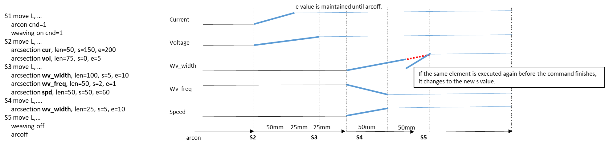
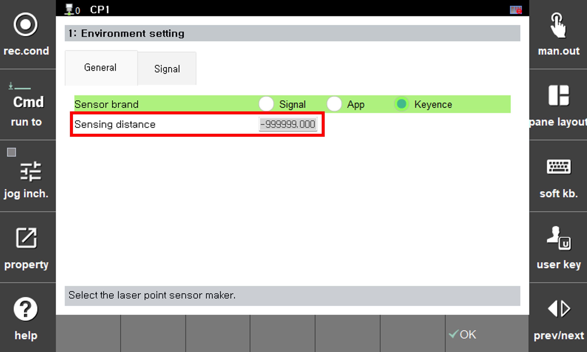
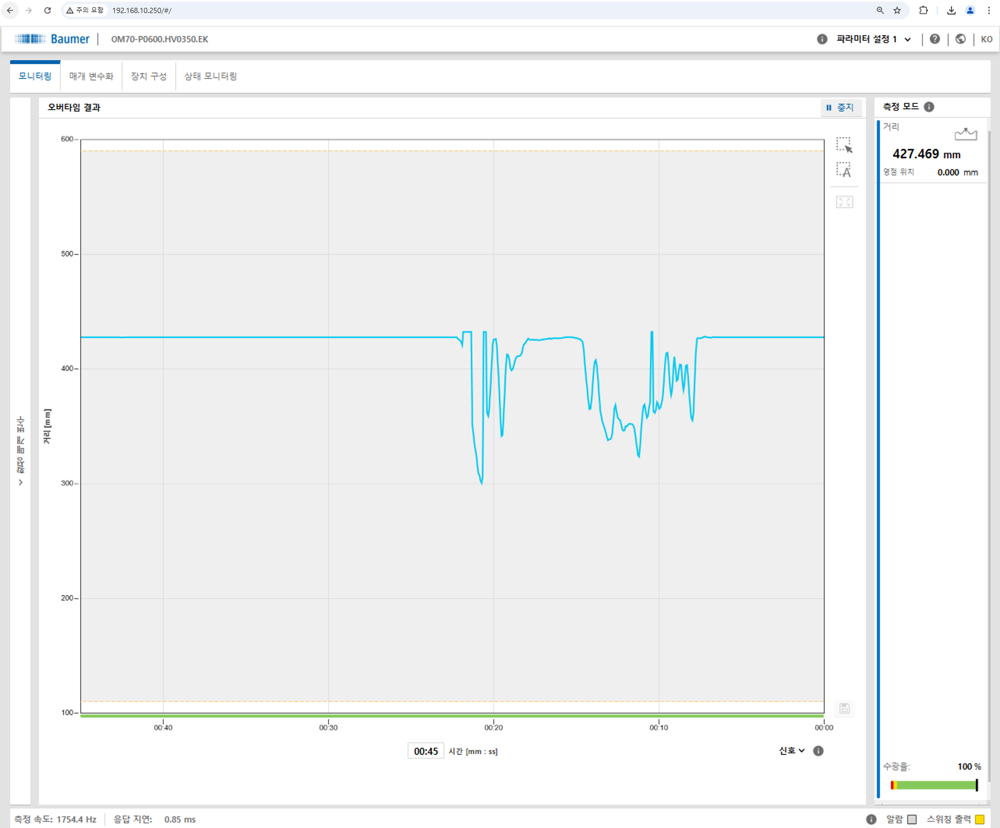
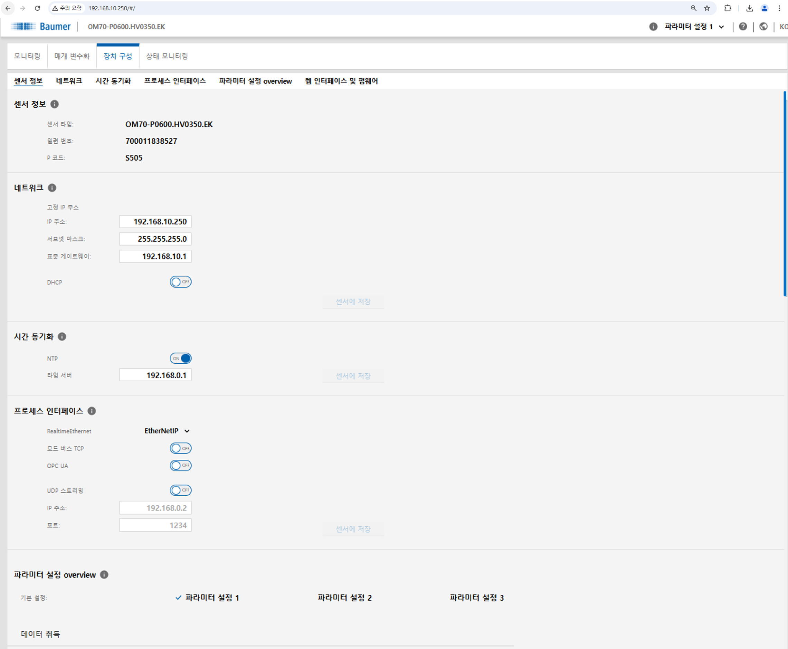
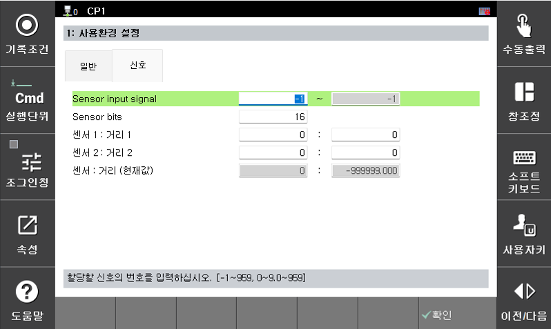

# 8.8.1 레이저 센서 기본설정  

LPS 기능을 사용하기 위해서는 최초 레이저 센서를 설치하고 통신 사양 등을 설정하는 과정이 필요합니다.  
 

### (1) 연결 브라켓을 이용한 레이저 센서 장착

연결 브라켓은 직접 설계하여 사용하거나 당사 혹은 센서 제조사로부터 받아 사용하십시오.

 
*그림 8.8.1. 브라켓을 이용한 레이저 센서 설치*

레이저 변위 센서는 발/수광부가 존재합니다. 아크 토치에 대해 로봇을 정렬시켰을 때 **레이저 센서의 발/수광부가 툴 기준 X 방향과 정렬이 되도록** 해야 합니다.(레이저 제조사 스펙 참고) 또한 툴의 Y 방향에 대해 우측(토치 바라봤을 때 우측)에 설치할 것을 권장합니다.
레이저를 설치하여 전원을 인가했을 때 툴의 끝과 레이저 포인트가 가까울수록 간섭이나 CT에 유리합니다. 마지막으로 툴 끝에 대해 센서 설치 위치는 사용하고자 하는 레이저 센서 사양(측정 범위)에 적합해야 하며, 사양 최소 거리보다는 높게 설치되어야 합니다.


  로봇의 플랜지에 센서 브라켓을 직결할 것을 권장하며 즉, '플랜지 - 레이저 센서 및 브라켓 - 쇼크센서(사용 시) - 토치'의 기구부를 갖도록 설치하십시오.


### (2) 통신 설정

레이저 센서 사양에 맞게 다음 링크를 참고하여 연결할 수 있습니다.(참고 - [${cont_model} - 산업용 통신](https://hrbook-hrc.web.app/#/view/doc-industrial-communication/ko-${cont_model}/README?cont_model=${cont_model}))

이 페이지에서는 일부 센서에 대한 예시만을 설명합니다.

설정을 진행하기 전에 센서 헤드, 컨트롤러, 통신 유닛(있을 경우), SMPS를 모두 연결 후에 전원을 인가합니다.(순서에 따라 센싱 값을 못 받는 경우가 있으므로 이후에도 센서를 먼저 연결해야 합니다.)  

#### 시리얼 통신 - 예: 키엔스 LK-G400

센서 컨트롤러 설정을 우선 진행합니다.

* 통신 속도 설정(필수)  
1. `SET` 키를 길게 누르고, `[UP]` 키를 눌러 `Enu`을 선택한다.
2. `ENT` 키를 누르고 `[RIGHT]` 키로 function `A`(RS-232C)을 선택한다.
3. `ENT` 키를 눌러 현재 값을 확인한다.(A-b0 ~ b4; 9600/19200/38400/57600/**115200**)

* 표시 단위 설정(옵션)  
1. `SET` 키를 길게 누르고, `[UP]` 키를 눌러 `oUt-1`을 선택한다.
2. `ENT` 키를 누르고 `[RIGHT]` 키로 function `G`을 선택한다.
3. `ENT` 키를 누르고 `[UP]` 키로 원하는 자릿수를 설정한다.(G-0 ~ ; 0.01, 0.001, ...)

`[F2: 시스템] - 4: 응용 파라미터 - 6: 레이저 포인트 센싱 - 1: 사용환경 설정`에 진입합니다. 

 
*그림 8.8.2. 레이저 통신 설정(키엔스 LK-G)*
 

LPS 브랜드 - Keyence를 클릭하여 설정합니다. 설정이 완료되면 **센싱 거리(mm)** 칸에 컨트롤러의 출력값과 동일하게 값이 들어옴을 확인할 수 있습니다.  

 

#### 이더넷 통신 - 예: 바우머 OM-70

PC와 연결하여 웹에 접속합니다.(최초 고정 IP는 192.168.0.250)

 
*그림 8.8.3. 바우머 센서 웹 설정*
   

`장치 구성(Device Configuration)` 탭에 진입하여 목적에 맞게 통신 방식을 설정합니다. 이때 프로세스 인터페이스에서 현재 통신 프로토콜에 맞는 방식만 활성화합니다.
그리고 이더넷IP를 사용한다면 네트워크 설정을 완료합니다. ${cont_model} 에서는 0번과 1번, 2번을 default로 사용하고 있으므로 다른 영역대를 사용해야 합니다.(예시: 192.168.10.250)

 
*그림 8.8.4. 바우머 센서 네트워크 설정*
    

이후 과정은 다음 링크를 따라 하나씩 수행하면 됩니다. 단, hi6에서는 내장 이더넷을 지원하지 않으므로 통신 카드를 이용해야 하고([Hi6 - 산업용 통신](https://hrbook-hrc.web.app/#/view/doc-industrial-communication/ko-Hi6/1-cifx-pci-communication/3-cifx-pci-settings-industrial-communication/3-EtherNet-IP/README?cont_model=Hi6)), hi7부터는 내장 이더넷을 지원하므로 제어기만으로 통신 연결이 가능합니다.([Hi7 - 산업용 통신](https://hrbook-hrc.web.app/#/view/doc-industrial-communication/ko-Hi7/2-ethernet-ip/4-scanner/README?cont_model=Hi7))

 
*그림 8.8.5. 바우머 센서 신호 할당*
 

위 과정이 완료되었으면 `[F2: 시스템] - 4: 응용 파라미터 - 6: 레이저 포인트 센싱 - 1: 사용환경 설정 - 신호 탭`에 진입합니다. 위에서 할당된 블럭에 대해 입력 신호를 설정하면 센서 값에 대해 거리(현재값)가 출력되는 것을 볼 수 있습니다.(센서-거리 맵핑이 필요하다면 추가 설정 필요)

#### 이더넷 통신 - 예: 키엔스 IL-300

* 해당 제조사 매뉴얼과 당사 매뉴얼을 참고하여 바우머 센서와 마찬가지로 연결해주면 됩니다. 위와 마찬가지로 hi6와 hi7 제어기에 따라 이더넷 연결 방법에 차이가 있습니다. 