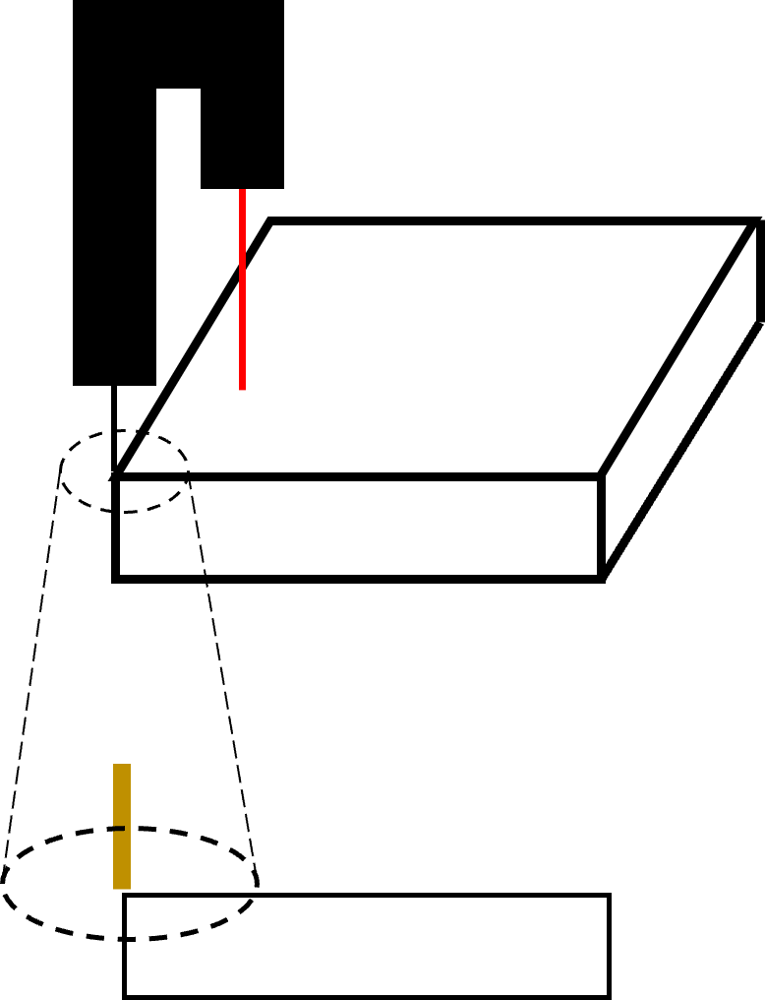

# 8.8.2 TCP-센서 캘리브레이션  

LPS 기능을 사용하기 위해서는 TCP와 센서 간 캘리브레이션이 선행되어야 합니다.

지금부터 TCP-센서 간 캘리브레이션 수행 방법을 살펴보겠습니다.  

<br/>

### (1) 캘리브레이션 시편 준비

당사를 통해 라이센스 구입을 하면 자동 캘리브레이션용 시편을 제공합니다.

<br/>


### (2) 준비 사항  

캘리브레이션을 수행하기 전에 툴을 캘리브레이션 평면에 대해 완벽히 정렬시켜야 합니다. 툴 좌표계 기준으로 X와 Y 방향으로 직접 교시하며 레이저 출력이 일정한지 확인하고(오차가 최소 0.5 이내로 오도록) RX, RY 값을 조정합니다.
툴을 정렬시켰다면 와이어 끝을 캘리브레이션 평면 끝에 위치시킵니다. 툴 기준 X-Y 방향으로 교시할 때 레이저 포인트가 모서리 끝에 타고 움직일 수 있도록 RZ 값을 조정합니다.

<p align="center">
  </img>
  <em><p align="center">그림 8.8.2.1 캘리브레이션 전 준비 사항</p></em>
</p><br/>  

위 과정을 완료했다면 캘리브레이션 수행을 위한 준비가 모두 끝났습니다.


### (3) 자동 캘리브레이션 수행

TCP 끝을 캘리브레이션 평면의 한 쪽 꼭짓점에 위치하도록 합니다. 또 레이저 포인트는 캘리브레이션 평면 안쪽에 위치해야 합니다.

<p align="center">
 </img>
 <em><p align="center">그림 8.8.2.2 캘리브레이션 시작</p></em>
</p><br/>  

하단 패널에서 `[F6: 명령입력] - arcweld - lps`를 클릭하여 하기 명령어를 삽입합니다.

```py
  lps auto_calib, cnd=1, Tx=<툴 기준 X 방향 이동거리>, Ty=<툴 기준 Y 방향 이동거리>
```

이때 이동거리는 레이저가 이동해야 하는 거리보다 크게 입력합니다. 만약 해당 인자 내에 검출하지 못한다면 캘리브레이션 에러가 발생합니다.

이제 자동 모드로 수행하면 다음과 같은 동작을 수행하며 캘리브레이션을 진행합니다.

1. 레이저 포인트가 Tx, Ty 방향으로 이동하며 처음 툴 끝 방향으로 이동.
2. 로봇 좌표계 기준 +Z 방향으로 들어올린 후, 1번과 같은 과정 수행.
3. 로봇 좌표계 기준 -Z 방향으로 하강하며 센서 발/수광부 방향(현재 브라켓 사양 Tx)에 대해 보간을 수행.

캘리브레이션이 모두 완료되면 스탭 좌측에 실행마크가 찍히며 움직임이 종료됩니다.


### (4) 캘리브레이션 정보

`[F2: 시스템] - 4: 응용 파라미터 - 6: 레이저 포인트 센싱 - 2: 캘리브레이션` 에 진입하여 캘리브레이션 결과를 확인할 수 있습니다. "캘리브레이션 완료" 칸에 "2"로 바뀌면 보간까지 모두 완료되었음을 의미합니다.
캘리브레이션 정보는 툴 번호마다 갖고 있고 툴 체인지 사용 시 유용합니다. 만약 툴 정보는 같지만 다른 번호를 사용하고자 할 때에는 복사하여 사용할 수 있습니다.  


<p align="center">
 </img>
 <em><p align="center">그림 8.8.2.3 캘리브레이션 결과</p></em>
</p><br/>  


