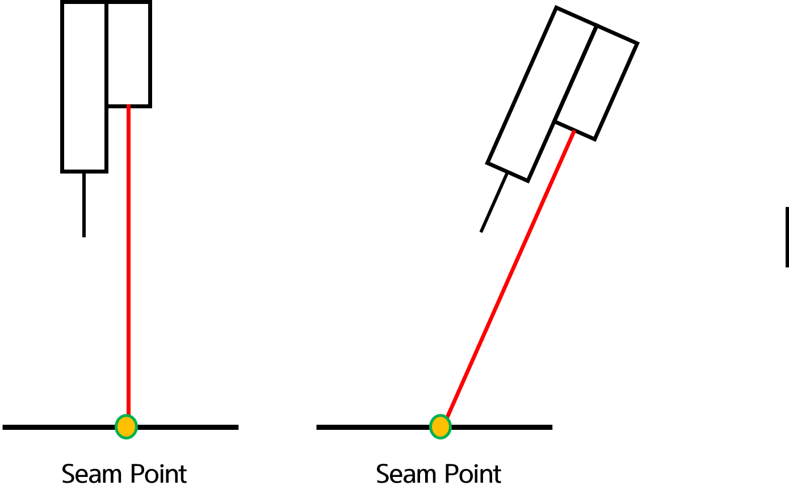
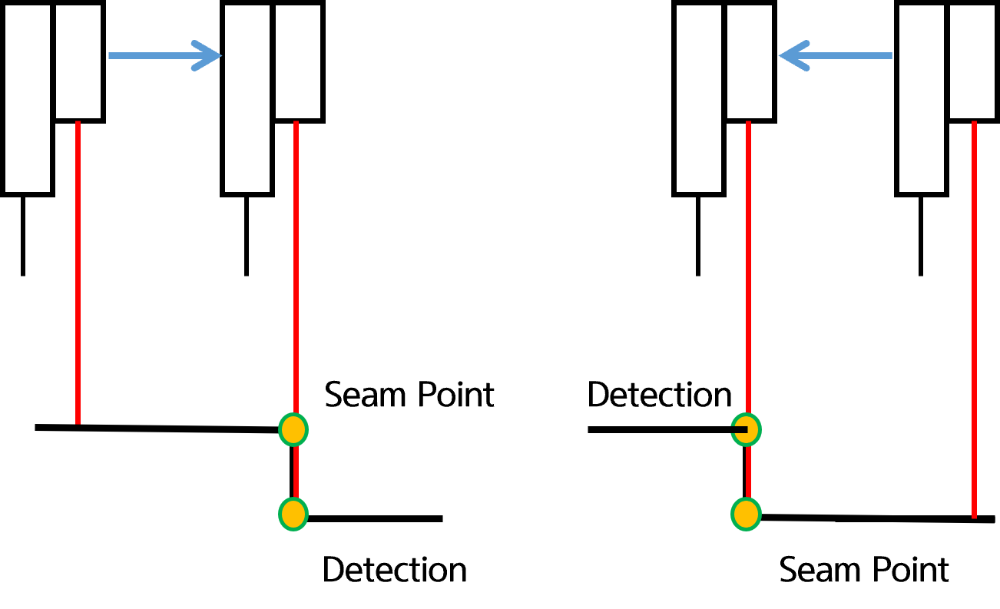
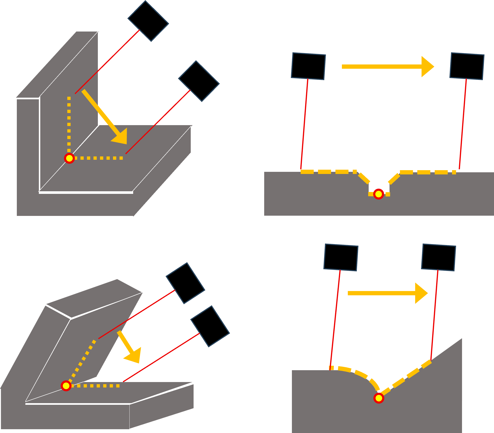
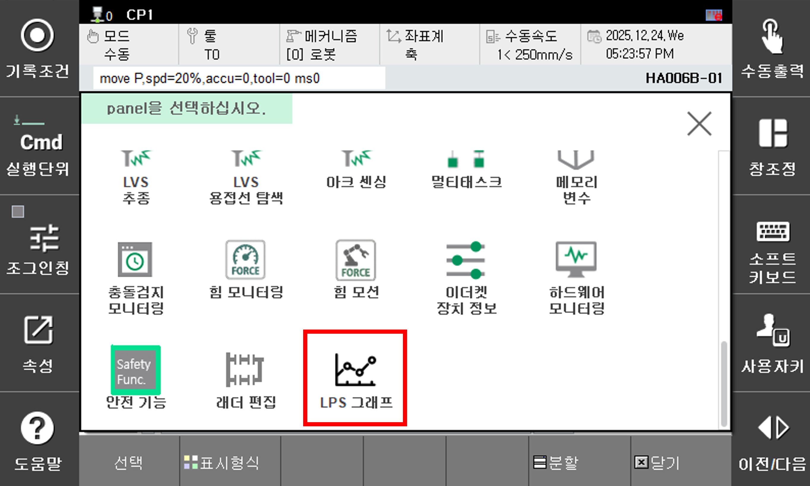

# 8.8.3 lps 기능 사용  



기능 사용전 툴-센서 간 캘리브레이션(8.8.2절 참조)이 수행되어 있지 않으면 비정상적인 포즈가 저장됩니다.



### (1) 한 점 모드(spot)  

한 점 모드는 캘리브레이션 결과를 확인하거나, 현재 레이저가 가리키는 지점의 포즈를 얻을 때 사용합니다.  

<p align="center">
  </img>
  <em><p align="center">그림 8.8.3.1 한 점 모드(spot)</p></em>
</p><br/>  

```py
  var p10=cpo()
  lps spot,cnd=1,pose=p10
  move L,tg=p10,spd=10%,acc=0,tool=0
```


이때 sp 매개변수로 지정된 포즈에는 위치만 기록되며 센싱 전 툴의 자세(Rx, Ry, Rz)는 유지하지 않습니다.


<br/>


### (2) 단차 모드(stepp)

단차 모드는 모재의 높이 차이가 있는(단차가 발생하는) 지점을 검출합니다. 이때 높이 차가 발생하는 지점이 아래인지 위인지에 따라 스캔 방향을 반대로 하면 됩니다.  

<p align="center">
  </img>
  <em><p align="center">그림 8.8.3.2 단차 모드(stepp)</p></em>
</p><br/>  

```py
  var p10=cpo()
  lps stepp,cnd=1,Tx=50,spd=5,pose=p10
  move L,tg=p10,spd=10%,acc=0,tool=0
```

툴 기준 x 혹은 y 방향으로 설정된 거리만큼 이동하며 단차를 탐색하며, 해당 거리 내에서 탐지가 되지 않는다면 검출 에러가 발생합니다.

<br/>


### (3) 스캔 모드(scan)

<p align="center">
 </img>
 <em><p align="center">그림 8.8.3.3 다양한 형상에서의 스캔 모드(scan)</p></em>
</p><br/>  

```py
  var p10=cpo()
  lps scan,cnd=1,Ty=50,spd=5,pose=p10
  move L,tg=p10,spd=10%,acc=0,tool=0
```

툴 기준 x 혹은 y 방향으로 설정된 거리만큼 이동하며 용접점을 검출합니다. 필렛, v-groove, 버트 등 형상 상관없이 하나의 명령어로 수행됩니다. 검출 결과는 REST API로 받아보거나 당사가 제공하는 앱을 등록하여 확인할 수 있습니다.

앱을 등록하여 사용하는 방법은 다음 링크를 참고해주십시오. - [SDK 설명서](https://hrbook-hrc.web.app/#/view/doc-hi6-sdk/korean-Hi6/README)



용접심을 포함하여 충분한 거리가 움직이도록 설정하고, 특히 툴의 움직임이 스캔되는 표면에 대해 수평하지 않아야 합니다.
  


#### (3-1) 모니터링 화면

<p align="center">
  </img>
  <em><p align="center">그림 8.8.3.4 LPS 그래프</p></em>
</p><br/>  

앱을 등록하면 다음 과정을 통해 모니터링 화면을 조회할 수 있습니다. **[창조정 → 분할 → 선택 → LPS 그래프]** 

<p align="center">
  </img>
  <em><p align="center">그림 8.8.3.5 예시 화면 - V-그루브 형상</p></em>
</p><br/>  

<p align="center">
  </img>
  <em><p align="center">그림 8.8.3.6 예시 화면 - Butt 형상</p></em>
</p><br/>  


기능을 수행하면 위 이미지와 같이 결과를 확인할 수 있습니다. 현재 제공하는 화면에서는 다음과 같은 기능을 제공합니다.  
좌측 상단 새로고침 버튼을 눌러 화면을 갱신할 수 있습니다. 우측 상단 숫자는 레이저 센서의 실시간 출력값을 나타냅니다. 빨간색 점을 통해 계산된 용접점을 알 수 있습니다. 추가로 수집된 데이터 점을 눌러보면 아래 그림과 같이 현재 좌표 결과를 표시합니다.

