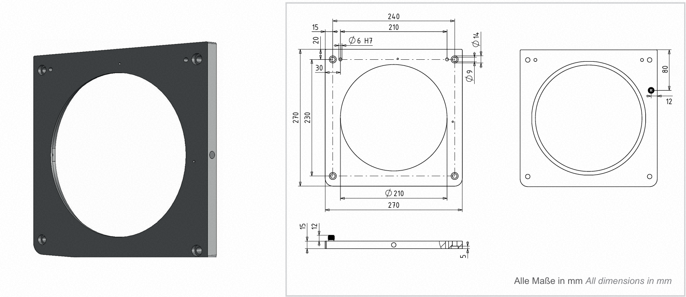

# 8.8.1 로봇 및 센서 준비

### (1) 툴 장착 및 자동 캘리브레이션

로봇에 사용할 툴을 장착한 후 자동 캘리브레이션을 수행하여 툴 데이터를 설정합니다. 자세한 방법은 다음 링크를 참고하십시오.  
(참고 - [${cont_model} 로봇제어기 조작설명서 - 축 원점 및 툴 길이 최적화](https://hrbook-hrc.web.app/#/view/doc-${cont_model}-operation/ko-tp630/7-system/7-auto-calibration/1-axis-origin-tool-length-optimization?cont_model=${cont_model}))

### (2) 센서 설치 및 좌표계 설정

 
*그림 8.8.1.1. 툴 보정 센서(예: 캡트론 ORL)*

툴 보정 센서는 설치 방향에 유의하여 장착해야 합니다. REFP가 표시된 면이 위쪽을 향하도록, 즉 센서 연결선이 아래쪽을 향하도록 설치하십시오.
이때 센서 연결선은 로봇 제어기의 아날로그 신호 포트에 연결합니다. 연결한 신호 포트는 `stdc` 명령어의 속성에서 설정할 수 있습니다.  

센서의 REFP를 기준으로 사용자 좌표계를 설정합니다. 좌표계 설정 방법은 다음 링크를 참고하십시오.  
(참고 - [${cont_model} 로봇제어기 조작설명서 - 사용자 좌표계](https://hrbook-hrc.web.app/#/view/doc-${cont_model}-operation/ko-tp630/7-system/3-control-parameter/6-cordsys-reg/1-user-crdsys?cont_model=${cont_model}))

설정한 사용자 좌표계는 `stdc` 명령어의 속성에서 센서 좌표계로 지정할 수 있습니다.

