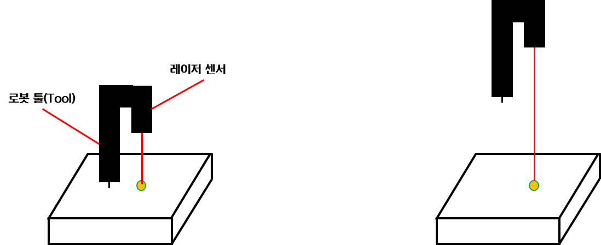
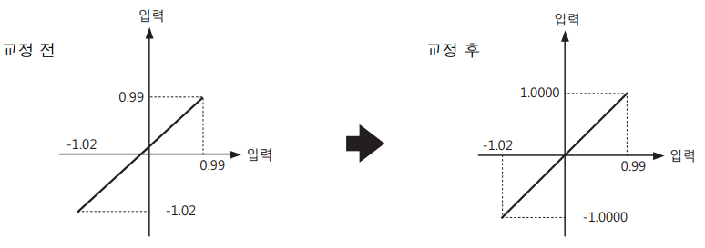

# 8.9.1 레이저 센서 기본설정  
(키엔스 LK-G400 기준)

LPS 기능을 사용하기 위해서는 최초 레이저 센서를 설치하고 통신 사양 등을 설정하는 과정이 필요합니다.  
 

#### (1) 브라켓을 이용한 LPS 센서 장착

// 그림 //


그림과 같이 센서는 용접봉의 우측에 설치하도록 합니다.
또한, 툴 좌표계를 설정 후에 최대한 표면과 수직하게 설치해야 오차가 가장 작습니다.
  

#### (2) 통신 및 기능 설정


통신 및 기기 설정에 대해서는 추후 보완될 예정입니다.  
센서 타입(브랜드)과 기본 통신 설정을 해주면 충분합니다.  
  

### 2-1. TP 입력 조작(예정)

LPS 센서 제어기와 로봇 제어기 간 시리얼 통신을 통해 접속합니다.  

`[System(시스템)] - [4: Application parameter(응용 파라미터)] - [6: LPS Setting]`에 진입합니다.  

다음 순서로 항목을 설정합니다.

- LPS 브랜드: Keyence LK-G400 / Keyence IL-300 / Baumer OM70
- 통신 속도(bps): 0(9600) / 1(19200) / 2(38400) / 3(57600) / 4(115200)
- Port 번호: 1(default)
- 통신 설정: 영점 설정, 스케일링 설정 등

 

### 2-2. LPS 센서 제어기 직접 조작

  **<통신 설정>**
1. `SET` 키를 길게 누르고, 🔼 키를 눌러 `Enu`를 선택합니다.
2. `ENT` 키를 누르고 ▶️ 키로 function `A`를 선택합니다.
3. `ENT` 키를 누르고 🔼 키로 `A-b4`(default, 115200)를 선택합니다.  
  (`A-b0` ~ `A-b4`: 9600/19200/38400/57600/115200)  
   

  **<스케일링 설정(교정)>**

 </img>
 <em>
그림 8.9.1 센서 설정 방법
</em>

1. 로봇의 tcp를 평면에 최대한 가깝게 두고 다음을 실행합니다.(좌측 그림)
2. `SET` 키를 길게 누르고, 🔼 키를 눌러 `out-1`을 선택합니다.
3. `ENT` 키를 누르고 ▶️ 키로 function `b`를 선택합니다.
4. `ENT` 키를 누르고 ▶️ 키로 function `b-0`를 선택합니다.
5. `ENT` 키를 누르고 ▶️/🔼 키로 포인트 1의 입력값1을 설정합니다.  
  (이때 `ZERO`키를 누르면 현재 측정값이 입력됩니다.)
6. `ENT` 키를 누르고 ▶️/🔼 키로 포인트 1의 표시값1을 설정합니다.  

7. 로봇을 **조그인칭**하여 센싱 범위 내에 평면과 최대한 멀리 두고 다음을 실행합니다.(우측 그림)
8. `ENT` 키를 누르고 ▶️/🔼 키로 포인트 2의 입력값2을 설정합니다.  
  (이때 `ZERO`키를 누르면 현재 측정값이 입력됩니다.)
9. `ENT` 키를 누르고 ▶️/🔼 키로 포인트 2의 표시값2을 설정합니다.
10. `ENT` 키를 눌러 설정을 등록하고, `SET` 키로 측정 상태로 돌아갑니다.  
 

 </img>
 <em>
8.9.2. 스케일링 설정(교정)
</em>

  **※ 참고 - 표시 단위 설정**
1. `SET` 키를 길게 누르고, 🔼 키를 눌러 `out-1`을 선택합니다.
2. `ENT` 키를 누르고 ▶️ 키로 function `G`를 선택합니다.
3. `ENT` 키를 누르고 🔼 키로 원하는 표시 단위로 설정합니다.  
<table>
  <thead>
    <tr>
      <th style="text-align:left">Function No.</th>
      <th style="text-align:left">최소 표시 단위</th>
      <th style="text-align:left">범위(단위)</th>
    </tr>
  </thead>
  <tbody>
    <tr>
      <td style="text-align:left">G-0</td>
      <td style="text-align:left">0.01</td>
      <td style="text-align:left">-9999.99 ~ +9999.99 (mm)</td>
    </tr>
    <tr>
      <td style="text-align:left">G-1</td>
      <td style="text-align:left">0.001</td>
      <td style="text-align:left">-999.999 ~ +999.999 (mm)</td>
    </tr>
    <tr>
      <td style="text-align:left">G-2</td>
      <td style="text-align:left">0.0001</td>
      <td style="text-align:left">-99.9999 ~ +99.9999 (mm)</td>
    </tr>
    <tr>
      <td style="text-align:left">G-3</td>
      <td style="text-align:left">0.00001</td>
      <td style="text-align:left">-9.99999 ~ +9.99999 (mm)</td>
    </tr>
    <tr>
      <td style="text-align:left">G-4</td>
      <td style="text-align:left">0.1</td>
      <td style="text-align:left">-99999.9 ~ +99999.9 (μm)</td>
    </tr>
    <tr>
      <td style="text-align:left">G-5</td>
      <td style="text-align:left">0.01</td>
      <td style="text-align:left">-9999.99 ~ +9999.99 (μm)</td>
    </tr>
  </tbody>
</table>

 

위 과정을 통해 기본 설정이 끝났습니다. 