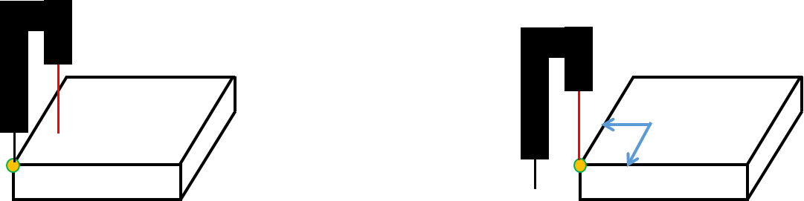
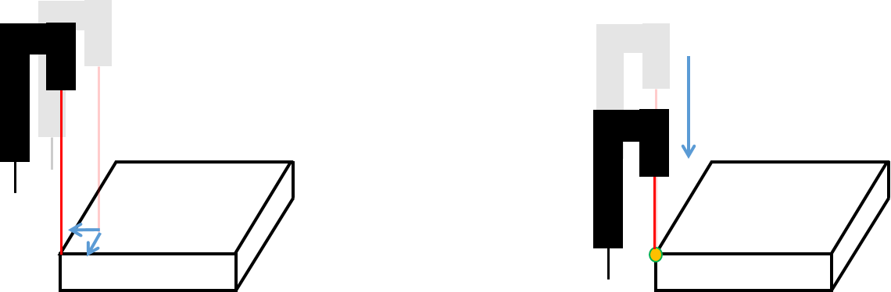
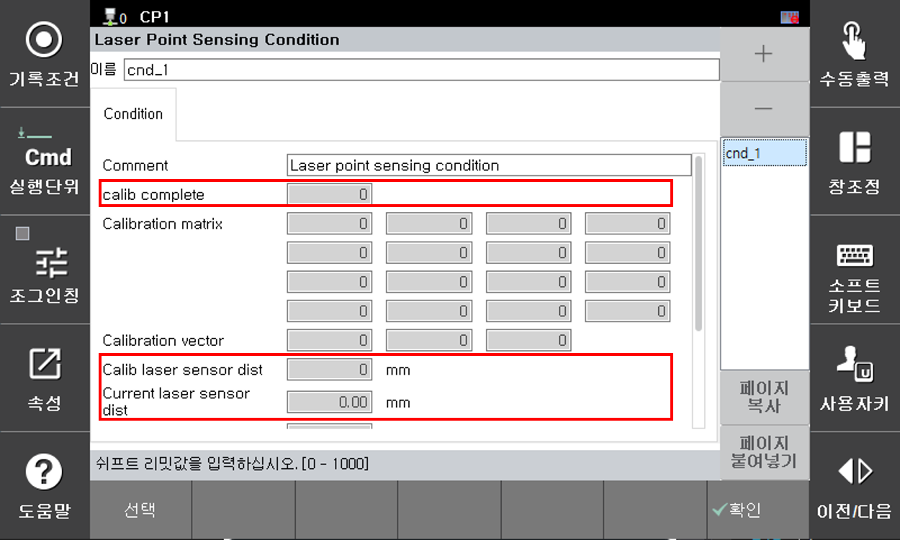

# 8.9.2 TCP-센서 캘리브레이션  

LPS 기능을 사용하기 위해서는 TCP와 센서 간 캘리브레이션이 선행되어야 합니다.  

지금부터 TCP-센서 간 캘리브레이션 수행 방법을 살펴보겠습니다.  

<br/>

#### (1) 캘리브레이션 시편 준비

```
당사를 통해 라이센스 구입을 하면 자동캘리브레이션용 시편을 제공합니다.  

테스트 용도로 우선 사용하고자 한다면 당사에 문의하여 캘리브레이션 시편을 준비하십시오.  
```  
<br/>


#### (2) 캘리브레이션 티칭  

캘리브레이션 과정은 총 4단계로 이루어져 있습니다.

아래에서 자세히 설명하겠습니다.

<br/>

<p align="center">
 </img>
 <em><p align="center">그림 8.9.3 캘리브레이션 1~2</p></em>
</p><br/>  

TCP의 자세를 시편과 수직이 되도록 위치시킵니다.

왼쪽 그림과 같이 시편의 끝점(좌측 앞쪽)에 TCP를 이동시킵니다. 이때 레이저는 시편 위에 오도록 해야 합니다.

하단 패널에서 `[명령입력] - [arcweld] - [lps]` 에서 하기 명령어를 삽입합니다.

```py
  # 캘리브레이션 1번 과정
  lps calib1, cnd=1
  
  # 캘리브레이션 2번 과정
  var p2 = cpo()
  lps calib2,cnd=1,pose=p2
```  
<br/>

1번 과정을 실행하면 현재 TCP의 포즈를 저장합니다.

2번 과정을 실행하면 오른쪽 그림과 같이 레이저를 시편 끝점(1번 과정에서 TCP 위치)으로 이동시킵니다. 여기서 평면에서의 캘리브레이션을 계산하고, `p2`에는 현재 포즈가 저장됩니다.

<br/>

<p align="center">
 </img>
 <em><p align="center">그림 8.9.4 캘리브레이션 3~4</p></em>
</p><br/>  

TCP를 조그인칭하여 센싱 범위 내에서 평면과 최대한 멀리 두고, 레이저는 시편 끝점에서 x, y축으로 각각 약 5mm 이상 떨어뜨립니다.

이 상태에서 `[기록]`을 눌러 `move` 명령문을 삽입합니다.

다시 하단 패널에서 `[명령입력] - [arcweld] - [lps]` 에서 하기 명령어를 삽입합니다.  

```py
  # 캘리브레이션 3번 과정
  move L,spd=60%,acc=0,tool=0  # 평면에서 최대한 떨어진 위치로 이동시킨다.
  var p3 = cpo()
  lps calib3,cnd=1,pose=p3

  # 캘리브레이션 4번 과정
  lps calib4,cnd=1
```  
<br/>

3번 과정을 실행하면 2번 과정과 마찬가지로 레이저를 끝점으로 이동시킵니다. 여기서 레이저 광선의 방향 벡터를 계산하고, `p3`에는 현재 포즈가 저장됩니다.

한편 레이저 센서의 특성 때문에 높이에 따라 발수광부에 대한 오차가 발생합니다.

따라서 4번 과정을 실행하면, TCP를 시편 방향으로 총 3번 하강시키며 높이에 따른 오차 보정을 수행합니다.  


#### (3) 참고 사항

<p align="center">
 </img>
 <em><p align="center">그림 8.9.5 lps 속성 창</p></em>
</p><br/>  


* 캘리브레이션 완료 여부는 lps 속성 창에 진입하여 확인 가능합니다.  
  `calib complete`가 `1`이면 캘리브레이션을 완료했음을 의미하고 `2`이면 오차 보정까지 완료되었음을 의미합니다.

* `calib laser sensor dist`는 캘리브레이션 평면 기준 레이저 거리값을 의미하고,  
  `Current laser sensor dist`는 현재 센서가 출력하는 거리값을 의미한다.
