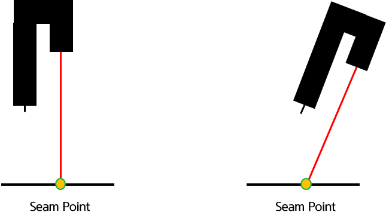
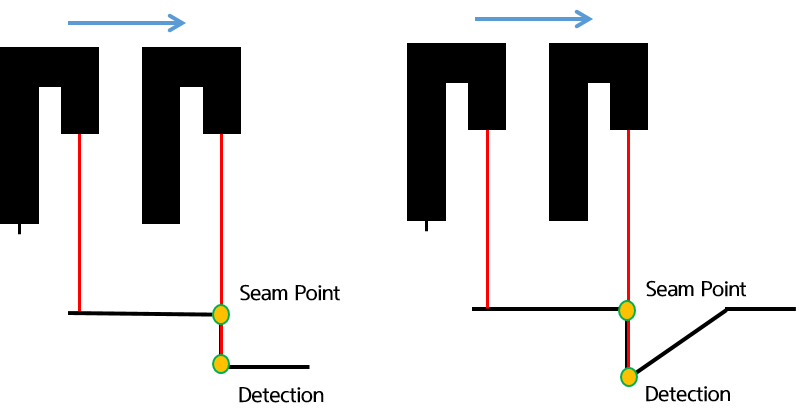
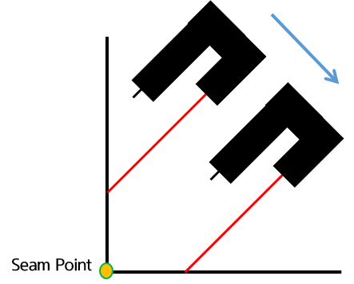
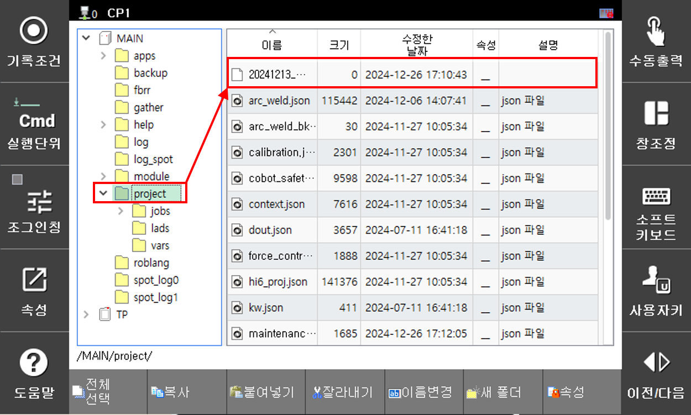

# 8.9.3 lps 사용  

LPS 기능을 사용하기 위해서는 최초 레이저 센서를 설치하고 통신 사양 등을 설정하는 과정이 필요합니다.  


### (1) 한 점 모드(spot)  

<p align="center">
 </img>
 <em><p align="center">그림 8.9.6 한 점 모드(spot)</p></em>
</p><br/>  

```py
  var p10 = cpo()
  lps spot,cnd=1,pose=p10
  move L,tg=p10,spd=60%,acc=0,tool=0
```

현재 레이저 포인트 지점을 저장(po1)하여 해당 위치로 이동할 수 있다.  


### (2) 단차 모드(gap)

<p align="center">
 </img>
 <em><p align="center">그림 8.9.7 단차 모드(gap)</p></em>
</p><br/>  

```py
  var p10 = cpo()
  lps gap,cnd=1,Ty=40,spd=5,pose=p10
  move L,tg=p10,spd=60%,acc=0,tool=0
```

툴 기준 x 혹은 y 방향으로 거리(40mm)를 설정하면 해당 방향(Tool Y)으로 이동하며 단차를 탐색합니다.

단차가 탐지되면 즉시 멈춰 현재 포즈(p10)에 저장하고, 만약 탐지되지 않았다면 에러가 발생합니다.  


### (3) 스캔 모드(scan)

<p align="center">
 </img>
 <em><p align="center">그림 8.9.8 필렛 모드(scan)</p></em>
</p><br/>  

```py
  var p10 = cpo()
  lps scan,cnd=1,Ty=40,spd=5,pose=p10
  move L,tg=p10,spd=60%,acc=0,tool=0
```

툴 기준 x 혹은 y 방향으로 거리(40mm)를 설정하면 해당 방향(Tool Y)으로 이동합니다.

설정된 거리만큼 이동되면 필렛 형상에 대해 원하는 점(p10)을 찾아 저장합니다. 만약 감지되는 점이 없다면 에러가 발생합니다.  

(탐지할 때 찾는 점 기준으로 전/후 거리가 비슷하게 해야 합니다.)


### (4) 게더링 모드(gather)

```py
  lps gather,cnd=1,Ty=40,spd=5,pose=p10
```

툴 기준 x 혹은 y 방향으로 거리(40mm)를 설정하면 해당 방향(Tool Y)으로 이동합니다.

설정된 거리만큼 이동하면서 센싱된 점들을 현재 시간을 기준으로 텍스트 파일에 저장합니다.

저장된 파일은 `[서비스] - [5: 파일관리]` 에서 `MAIN > project` 경로에서 확인 가능합니다.  

<br/>
<p align="center">
 </img>
 <em><p align="center">그림 8.9.9 게더링 모드(gather)</p></em>
</p><br/>  
