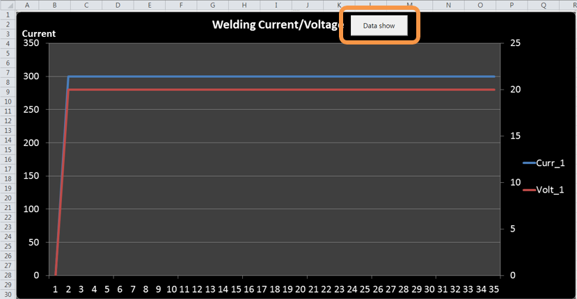
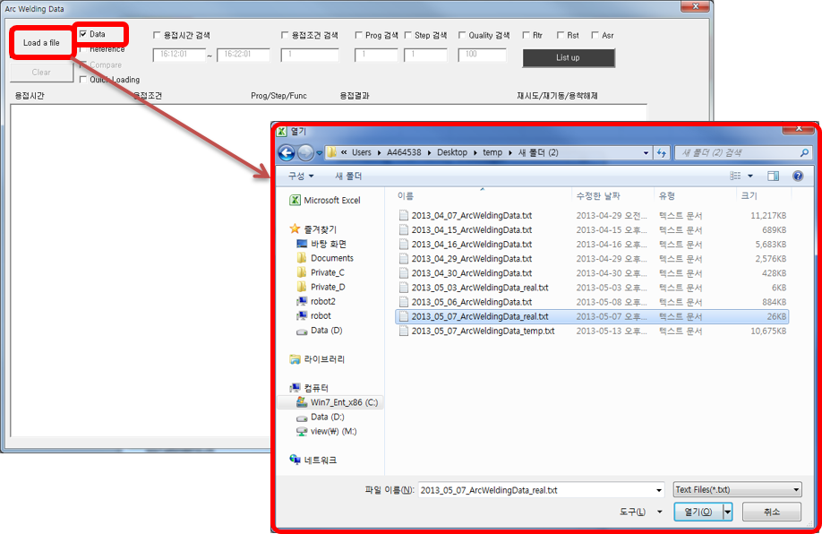
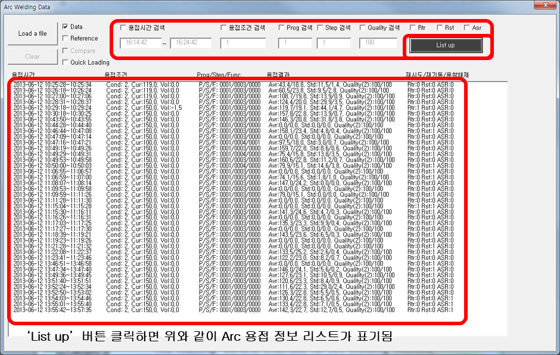
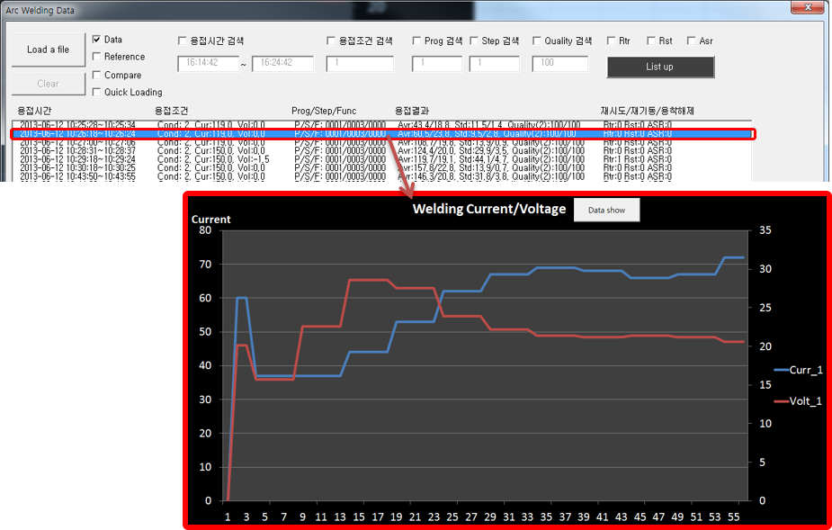

# 9.1.1 基本功能

(1) 弹出对话框

- 	打开'xlsm'文件后，点击'Drawing Graph'按钮。  
-	点击后弹出'Arc Welding Data'对话框。

 
*图 9.1 焊接数据图*

(2) 选择Arc焊接数据文件

-	勾选'Data'后，点击'Load a file'按钮。  
-	选择要确认的Arc焊接数据文件，如下所示。

 
*图 9.2 焊接数据文件*

(3) 设置搜索条件

-	输入所需的搜索条件。 (未输入时加载全部焊接数据)
-	点击'List up'按钮，焊接信息如下所示。

 
*图 9.3 焊接信息列表*

(4) 选择数据

-	从标记的列表中选择一个。
-	对应的焊接图在Excel图表中显示。

 
*图 9.4 焊接数据选择*