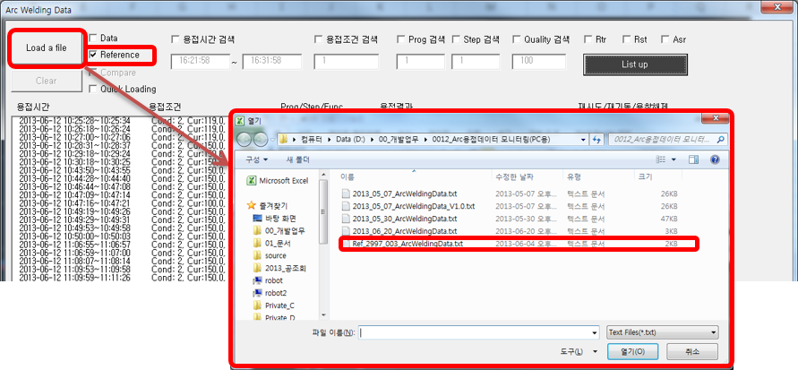
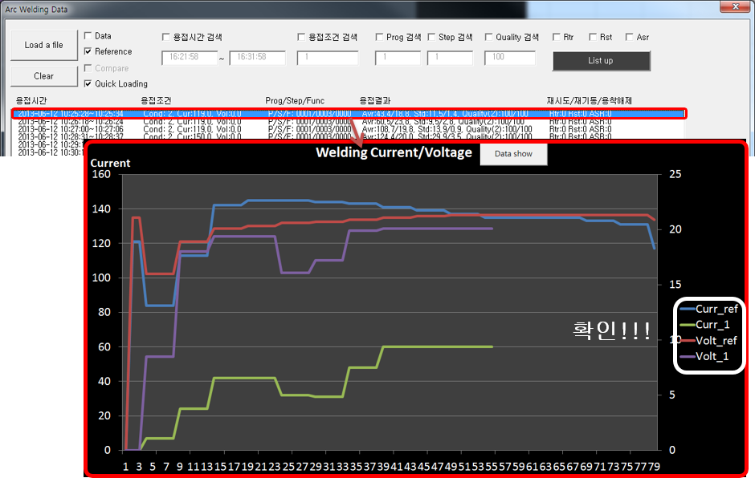

# 9.1.2 基准文件

(1) 选择基准文件

- 勾选 'Reference' 后点击 'Load a file' 按钮。
- 在弹出的对话框中选择要确认的基准文件。
- 选择时基准文件的图表被绘制，并且固定以便与其他数据进行比较。

 
*图 9.5 选择基准文件*

(2) 选择比较数据

- 在基准图固定状态下，选择列表中的数据后，可以在图表中标示所选择的数据与基准数据的比较。

 
*图 9.6 选择比较数据*