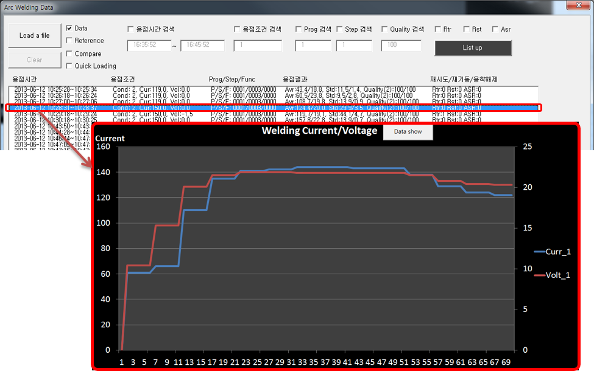
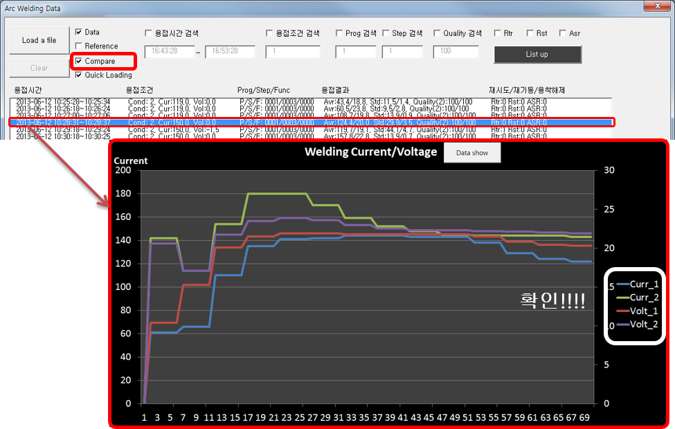

# 9.1.3 比较功能

(1) 第一个数据选择

- 固定一般数据作为比较对象，而非基准数据
- 在按下 'Clear' 按钮之前将继续处于比较模式
- 从列表中选择将被固定的第一个数据

 
*图 9.7 第一个数据选择*

(2) 第二个数据选择

- 勾选 'Compare' 后，从列表中选择作为比较对象的第二个数据。
- 选择时，Excel 图表中将显示这两个数据的比较结果。

 
*图 9.8 第二个数据选择*